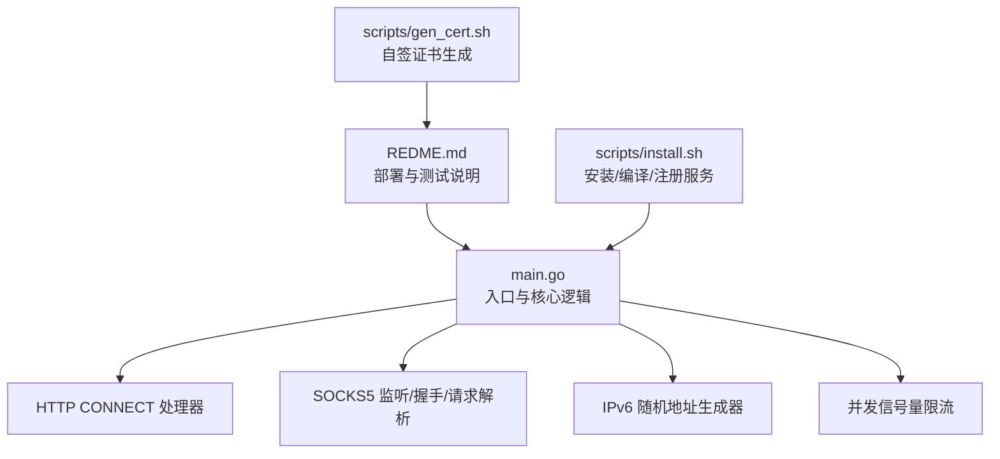
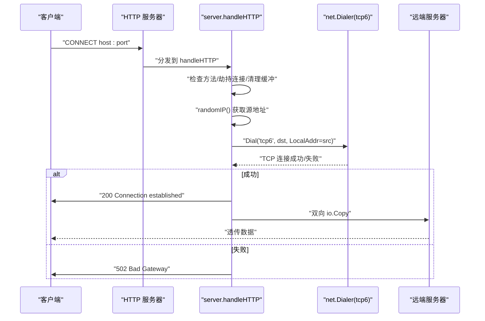
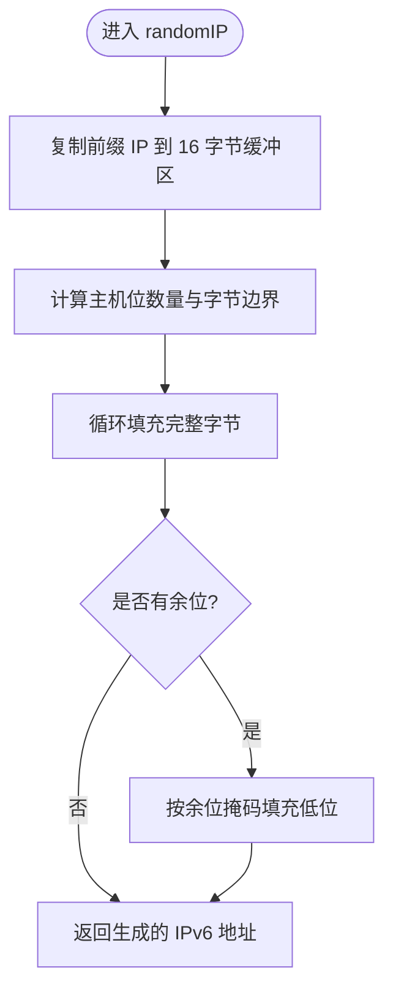
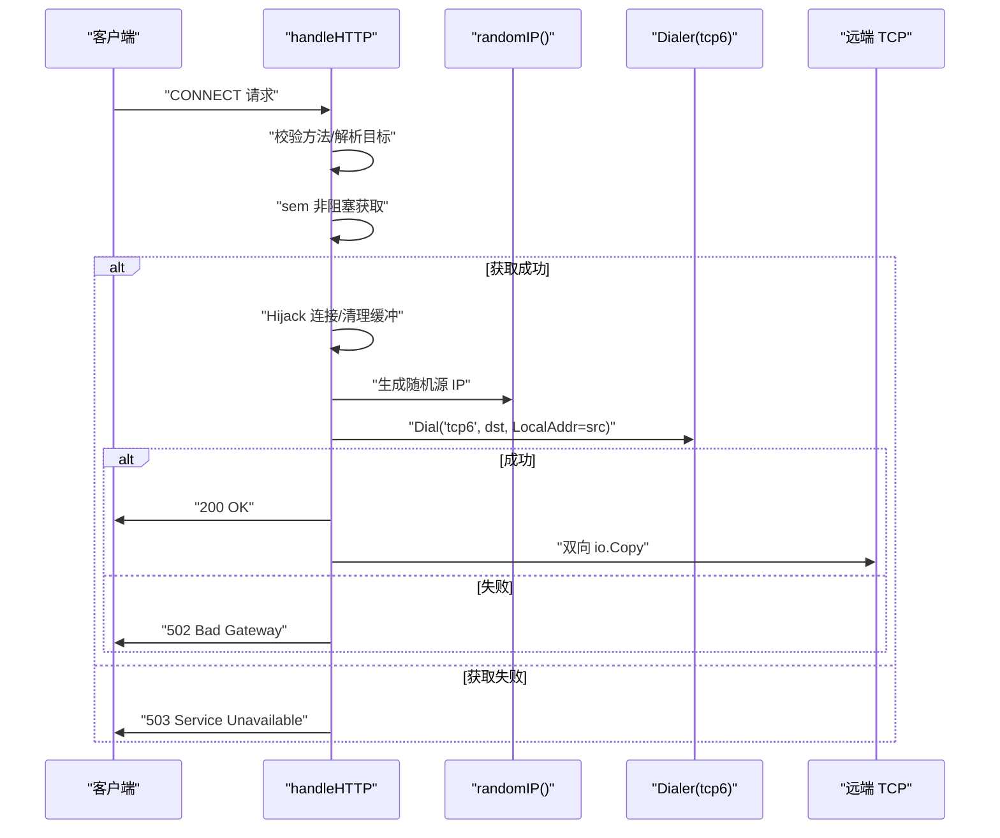
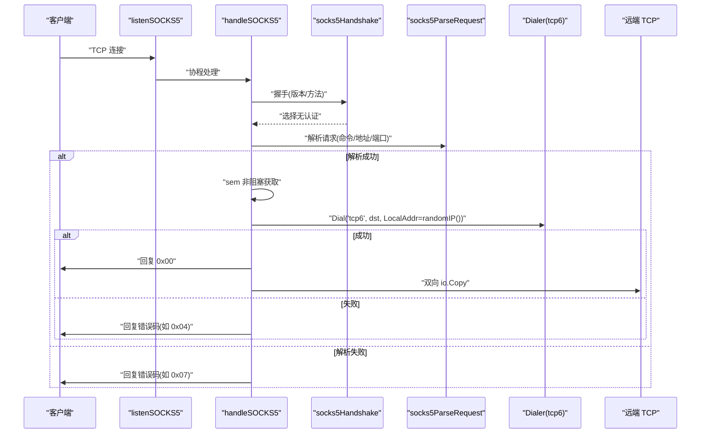
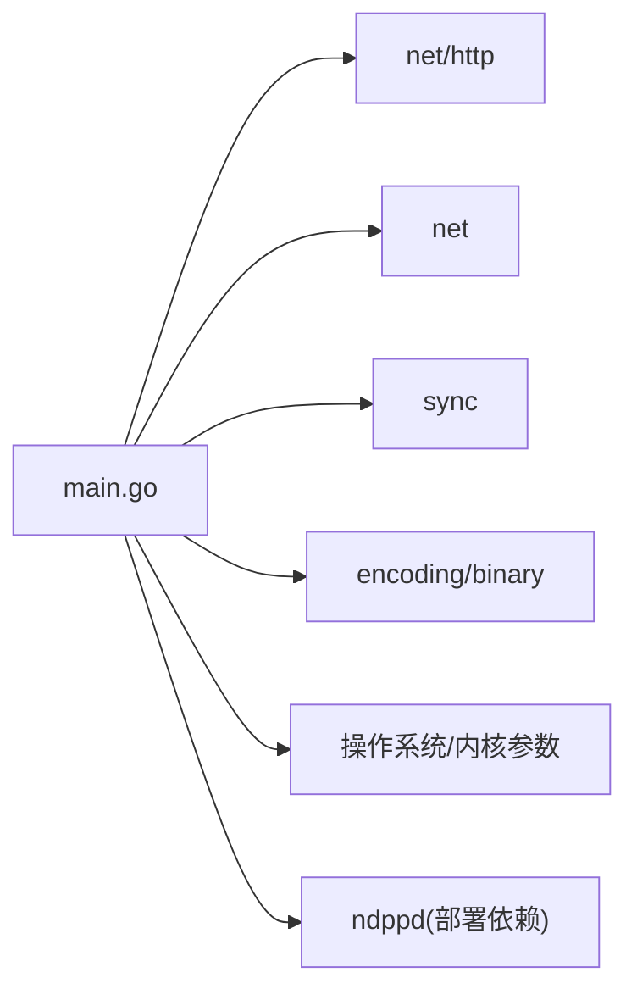

# 开发指南

<cite>
**本文引用的文件**   
- [main.go](file://main.go)
- [REDME.md](file://REDME.md)
- [install.sh](file://scripts/install.sh)
- [gen_cert.sh](file://scripts/gen_cert.sh)
</cite>

## 目录
1. [简介](#简介)
2. [项目结构](#项目结构)
3. [核心组件](#核心组件)
4. [架构总览](#架构总览)
5. [详细组件分析](#详细组件分析)
6. [依赖关系分析](#依赖关系分析)
7. [性能与并发特性](#性能与并发特性)
8. [扩展开发指南](#扩展开发指南)
9. [开发与调试最佳实践](#开发与调试最佳实践)
10. [故障排查](#故障排查)
11. [结论](#结论)

## 简介
本项目是一个基于 IPv6 前缀的轻量级代理池，提供 HTTP CONNECT 与 SOCKS5 两种协议接入，强制使用 IPv6 出口，并通过随机源 IP 实现“多出口”效果。程序采用纯 Go 实现、零外部依赖，内置并发限流，适合在 /64 或更小子网（如 /112）下部署，配合系统路由与 NDP 代理实现本地任意 IPv6 地址出站。

## 项目结构
仓库根目录包含入口程序、文档与脚本：
- main.go：主程序，定义 server 结构体、HTTP CONNECT 与 SOCKS5 处理逻辑、IPv6 随机地址生成、并发控制等
- REDME.md：使用说明、内核参数优化、ndppd 配置、编译运行步骤
- scripts/install.sh：一键安装脚本，负责拉取源码、编译、写入 systemd 服务单元、配置内核参数等
- scripts/gen_cert.sh：生成自签证书，便于与 v2ray/xray 集成

图表来源
- [main.go:1-347](file://main.go#L1-L347)
- [REDME.md:1-98](file://REDME.md#L1-L98)
- [install.sh:1-101](file://scripts/install.sh#L1-L101)
- [gen_cert.sh:1-38](file://scripts/gen_cert.sh#L1-L38)

章节来源
- [main.go:1-347](file://main.go#L1-L347)
- [REDME.md:1-98](file://REDME.md#L1-L98)
- [install.sh:1-101](file://scripts/install.sh#L1-L101)
- [gen_cert.sh:1-38](file://scripts/gen_cert.sh#L1-L38)

## 核心组件
- server 结构体
  - 职责：持有 IPv6 前缀网络对象、随机数生成器、互斥锁与并发信号量；对外暴露 randomIP 方法用于分配随机源地址
  - 设计要点：将“地址空间 + 并发控制”集中在一个聚合对象中，简化调用方耦合
- HTTP CONNECT 处理器
  - 职责：校验方法为 CONNECT，劫持底层连接，根据目标主机建立 tcp6 出站连接，双向转发数据
  - 关键点：使用 Hijacker 获取原始 TCP 连接；通过 Dialer 绑定随机源 IP；对失败路径返回 502
- SOCKS5 监听与处理
  - 职责：监听端口，完成握手、解析请求（仅支持域名与 IPv6）、建立 tcp6 出站连接并双向转发
  - 关键点：不支持 IPv4 地址类型；错误码遵循 RFC 约定
- IPv6 随机地址生成
  - 职责：在给定前缀范围内生成随机主机位，保证不越界
  - 关键点：按掩码长度计算主机位字节边界，分别填充完整字节与剩余低位
- 并发控制
  - 职责：使用带缓冲 channel 作为信号量限制最大并发连接数
  - 关键点：非阻塞 select 拒绝超额连接，避免资源耗尽

章节来源
- [main.go:24-29](file://main.go#L24-L29)
- [main.go:78-104](file://main.go#L78-L104)
- [main.go:108-197](file://main.go#L108-L197)
- [main.go:201-274](file://main.go#L201-L274)
- [main.go:276-346](file://main.go#L276-L346)

## 架构总览
整体采用单进程、事件驱动风格：主函数解析参数、初始化 server、启动 HTTP 与 SOCKS5 监听协程，等待退出。每个入站连接进入各自处理流程，统一通过信号量进行并发上限控制，出站一律走 tcp6，并以随机源 IP 拨号。

图表来源
- [main.go:31-76](file://main.go#L31-L76)
- [main.go:108-197](file://main.go#L108-L197)

章节来源
- [main.go:31-76](file://main.go#L31-L76)
- [main.go:108-197](file://main.go#L108-L197)

## 详细组件分析

### server 结构体与 IPv6 随机地址算法
- 数据结构
  - network：存储前缀网络对象，用于限定随机地址范围
  - rnd：线程安全的随机数源
  - mu：保护 randomIP 的临界区
  - sem：带缓冲 channel，作为并发信号量
- 随机地址生成算法
  - 复制前缀 IP 到 16 字节缓冲区
  - 根据掩码长度计算主机位数量与字节边界
  - 从低到高逐字节填充随机值，处理不足一字节时的低位掩码
  - 时间复杂度 O(1)，空间复杂度 O(1)

图表来源
- [main.go:78-104](file://main.go#L78-L104)

章节来源
- [main.go:24-29](file://main.go#L24-L29)
- [main.go:78-104](file://main.go#L78-L104)

### HTTP CONNECT 代理流程
- 关键步骤
  - 校验方法必须为 CONNECT
  - 解析目标地址，缺失端口时补默认 443
  - 通过信号量进行并发控制，超限直接返回 503
  - 劫持底层连接，清空残留缓冲，设置 TCP_NODELAY
  - 随机源 IP 拨号 tcp6，失败返回 502
  - 成功后发送 200，双工转发数据
- 错误处理
  - 方法非法：405
  - 无法 Hijack：500
  - 拨号失败：502
  - 并发超限：503

图表来源
- [main.go:108-197](file://main.go#L108-L197)

章节来源
- [main.go:108-197](file://main.go#L108-L197)

### SOCKS5 代理流程
- 监听与接受
  - 监听指定端口，每连接起协程处理
- 握手
  - 读取版本与方法列表，选择无认证方式
- 请求解析
  - 仅支持命令 CONNECT（0x01）
  - 地址类型：域名（0x03）与 IPv6（0x04），不支持 IPv4（0x01）
- 拨号与转发
  - 随机源 IP 拨号 tcp6，成功则回复 0x00，失败回复相应错误码
  - 双工转发数据

图表来源
- [main.go:201-274](file://main.go#L201-L274)
- [main.go:276-346](file://main.go#L276-L346)

章节来源
- [main.go:201-274](file://main.go#L201-L274)
- [main.go:276-346](file://main.go#L276-L346)

## 依赖关系分析
- 标准库依赖
  - net/http：HTTP 服务器与 Hijacker
  - net：TCP 监听、拨号、地址解析
  - sync：WaitGroup、Mutex、channel 并发原语
  - encoding/binary：大端序端口解析
  - log、flag、fmt、io、time、errors、math/rand：基础能力
- 外部工具依赖（部署阶段）
  - ndppd：NDP 代理，使本地任意 IPv6 地址可达
  - openssl：生成自签证书（可选）
  - go：编译构建

图表来源
- [main.go:1-15](file://main.go#L1-L15)
- [REDME.md:28-77](file://REDME.md#L28-L77)

章节来源
- [main.go:1-15](file://main.go#L1-L15)
- [REDME.md:28-77](file://REDME.md#L28-L77)

## 性能与并发特性
- 并发模型
  - 每个入站连接独立协程处理，避免阻塞
  - 使用带缓冲 channel 作为全局信号量，限制最大并发连接数，防止内存与文件描述符耗尽
- I/O 路径
  - 使用 io.Copy 进行零拷贝式数据转发，减少用户态拷贝开销
  - 设置 TCP_NODELAY 降低小包延迟
- 地址分配
  - randomIP 为 O(1) 操作，无额外分配热点
- 建议
  - 根据机器 CPU 与内存调整 -c 参数
  - 在高吞吐场景可考虑启用 SO_REUSEPORT（需平台支持）
  - 结合 smux 复用长连接以降低 conntrack 压力（见 README）

[本节为通用性能讨论，无需特定文件引用]

## 扩展开发指南

### 添加新的代理协议支持
- 参考现有模式
  - 新增监听入口：仿照 listenSOCKS5 创建新监听函数，Accept 后起协程处理
  - 协议处理：仿照 handleSOCKS5 实现握手、请求解析、拨号与转发
  - 并发控制：在入口处使用 sem 进行限流
- 代码位置参考
  - 监听入口与协程分发：[main.go:201-216](file://main.go#L201-L216)
  - 连接处理主流程：[main.go:218-274](file://main.go#L218-L274)
  - 握手与请求解析：[main.go:276-346](file://main.go#L276-L346)

章节来源
- [main.go:201-274](file://main.go#L201-L274)
- [main.go:276-346](file://main.go#L276-L346)

### 实现自定义的地址分配策略
- 当前策略
  - 随机填充主机位，保证均匀分布
- 替换方案
  - 轮询/哈希：维护有序地址池，按连接 ID 或目标哈希选择固定源 IP，便于统计与追踪
  - 权重策略：按地域或上游质量加权选择
- 修改点
  - 替换 randomIP 内部实现，保持签名不变
  - 若引入状态，注意并发安全（加锁或使用 per-G 缓存）
- 代码位置参考
  - 随机地址生成：[main.go:78-104](file://main.go#L78-L104)

章节来源
- [main.go:78-104](file://main.go#L78-L104)

### 集成第三方组件
- 与 v2ray/xray 配合
  - 通过 smux 复用连接，缓解路由器 conntrack 压力
  - 可使用 gen_cert.sh 生成自签证书供上层 TLS 使用
- 证书生成
  - 脚本会输出证书与私钥路径，并在 CN/SAN 中注入公网 IP
- 代码位置参考
  - 证书生成脚本：[gen_cert.sh:1-38](file://scripts/gen_cert.sh#L1-L38)
  - README 集成说明：[REDME.md:11-12](file://REDME.md#L11-L12)

章节来源
- [gen_cert.sh:1-38](file://scripts/gen_cert.sh#L1-L38)
- [REDME.md:11-12](file://REDME.md#L11-L12)

## 开发与调试最佳实践
- 代码规范
  - 单一职责：每个函数只做一件事（握手、解析、拨号、转发）
  - 错误优先：所有 I/O 分支均需记录日志并返回明确状态
  - 并发安全：共享状态加锁，避免竞态
- 测试方法
  - 单元测试：针对 randomIP 覆盖不同掩码长度（/64、/112、/120 等）
  - 集成测试：使用 curl --proxy 与 --socks5 验证连通性与出口 IP
  - 压测：ab/wrk 模拟高并发，观察 -c 阈值与错误率
- 调试技巧
  - 开启详细日志：关注 [HTTP-OK]/[HTTP-FAIL]、[SOCKS5-OK]/[SOCKS5-FAIL] 日志
  - 抓包：tcpdump 过滤端口与协议，确认握手与转发行为
  - 系统层：ss/netstat 查看连接数与 TIME_WAIT，sysctl 调整内核参数
- 部署与运维
  - 使用 install.sh 自动配置内核参数与服务单元
  - 配置 ndppd 与本地路由，确保 /64 子网可达
- 参考位置
  - 安装脚本：[install.sh:1-101](file://scripts/install.sh#L1-L101)
  - README 部署步骤：[REDME.md:28-98](file://REDME.md#L28-L98)

章节来源
- [install.sh:1-101](file://scripts/install.sh#L1-L101)
- [REDME.md:28-98](file://REDME.md#L28-L98)

## 故障排查
- 常见错误与定位
  - 方法不允许：HTTP 非 CONNECT 请求被拒
    - 参考：[main.go:112-115](file://main.go#L112-L115)
  - 无法 Hijack：底层未实现 Hijacker
    - 参考：[main.go:136-140](file://main.go#L136-L140)
  - 拨号失败：目标不可达或 DNS 解析异常
    - 参考：[main.go:164-169](file://main.go#L164-L169)
  - 并发超限：-c 过小导致 503
    - 参考：[main.go:127-133](file://main.go#L127-L133)
  - SOCKS5 握手失败：版本或方法不支持
    - 参考：[main.go:276-291](file://main.go#L276-L291)
  - 请求解析失败：地址类型或命令不支持
    - 参考：[main.go:293-336](file://main.go#L293-L336)
- 系统层面
  - 未配置本地路由或 ndppd：远端无法回包
    - 参考：[REDME.md:55-77](file://REDME.md#L55-L77)
  - 内核参数未生效：连接回收慢、端口不足
    - 参考：[REDME.md:31-40](file://REDME.md#L31-L40)

章节来源
- [main.go:112-115](file://main.go#L112-L115)
- [main.go:136-140](file://main.go#L136-L140)
- [main.go:164-169](file://main.go#L164-L169)
- [main.go:127-133](file://main.go#L127-L133)
- [main.go:276-291](file://main.go#L276-L291)
- [main.go:293-336](file://main.go#L293-L336)
- [REDME.md:31-40](file://REDME.md#L31-L40)
- [REDME.md:55-77](file://REDME.md#L55-L77)

## 结论
本项目的架构简洁清晰：以 server 为中心聚合地址空间与并发控制，HTTP CONNECT 与 SOCKS5 两条链路共用 randomIP 与信号量机制，统一通过 tcp6 出站。该设计在保证功能完备的同时，易于扩展与调优。建议在大规模部署时结合 smux 复用、合理设置 -c 与内核参数，并完善日志与监控指标，以获得稳定高效的代理服务体验。