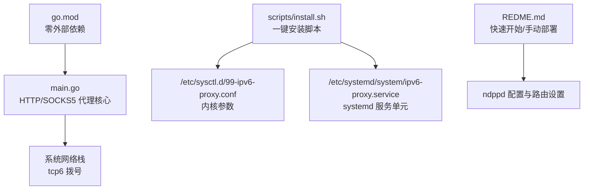
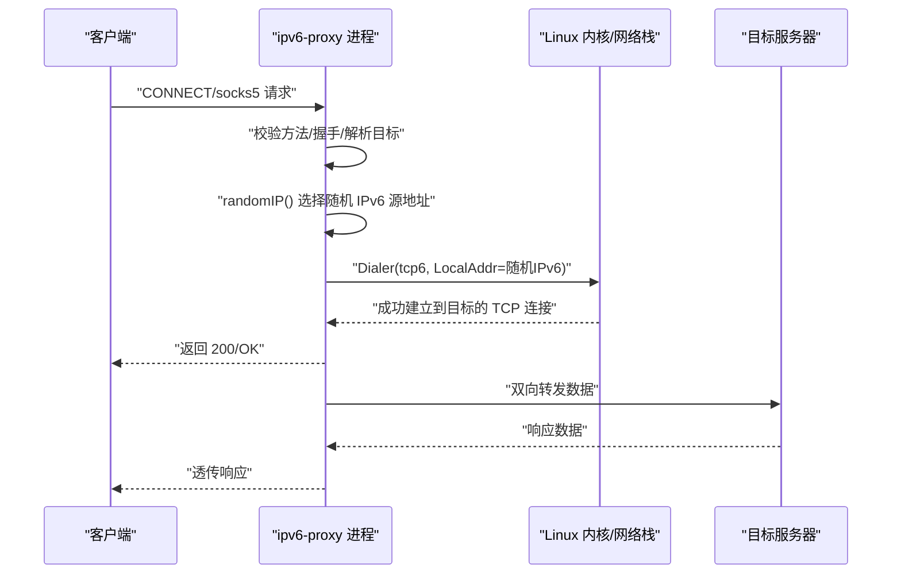
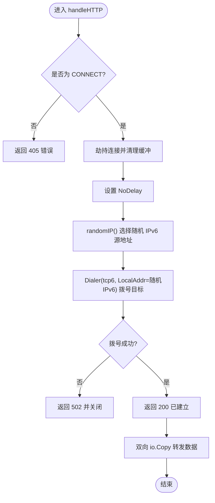
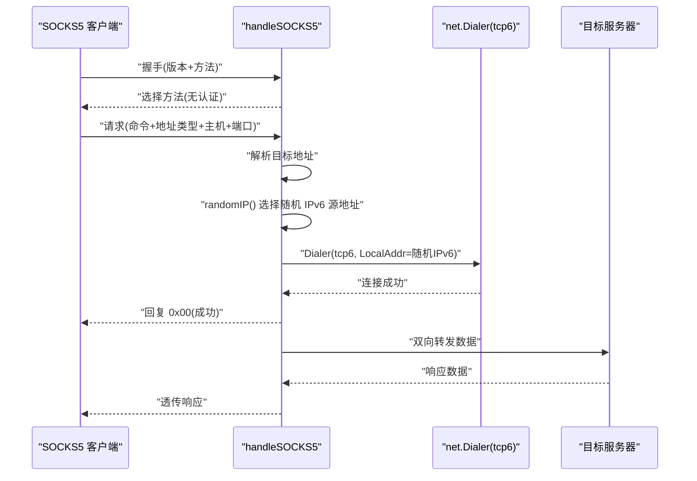
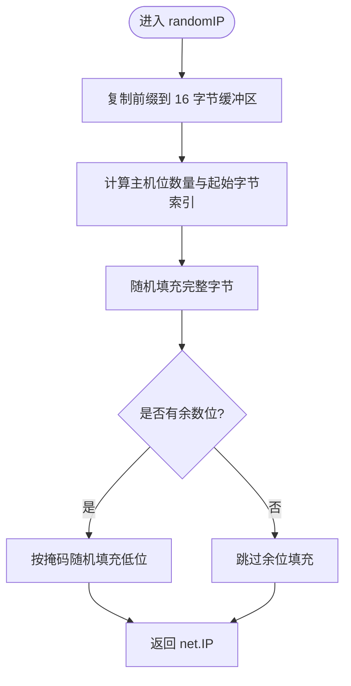

# 快速开始

<cite>
**本文引用的文件**   
- [main.go](file://main.go)
- [REDME.md](file://REDME.md)
- [install.sh](file://scripts/install.sh)
- [go.mod](file://go.mod)
</cite>

## 目录
1. [简介](#简介)
2. [项目结构](#项目结构)
3. [核心组件](#核心组件)
4. [架构总览](#架构总览)
5. [详细组件分析](#详细组件分析)
6. [依赖分析](#依赖分析)
7. [性能与并发特性](#性能与并发特性)
8. [常见部署场景与配置模板](#常见部署场景与配置模板)
9. [测试验证](#测试验证)
10. [故障排查](#故障排查)
11. [结论](#结论)

## 简介
本指南面向需要在 Linux 环境下快速部署 IPv6 代理池的用户。该工具基于 Go 实现，提供 HTTP CONNECT 与 SOCKS5 两种代理服务，并通过随机分配指定前缀的 IPv6 地址作为出站源 IP，从而实现“多出口”效果。文档将覆盖环境要求、前置条件、一键安装、手动编译、systemd 服务化、基本使用示例、常见部署场景与配置模板，以及基础测试与排错方法。

## 项目结构
仓库包含以下关键内容：
- main.go：程序入口与核心逻辑（HTTP CONNECT、SOCKS5、IPv6 源地址生成、并发限流）
- scripts/install.sh：一键安装脚本（安装依赖、下载源码、编译、系统参数优化、安装 systemd 服务）
- REDME.md：快速开始与手动部署说明
- go.mod：Go 模块定义（当前为空，表示零外部依赖）

图表来源
- [main.go:1-347](file://main.go#L1-L347)
- [install.sh:1-101](file://scripts/install.sh#L1-L101)
- [REDME.md:1-98](file://REDME.md#L1-L98)
- [go.mod:1-1](file://go.mod#L1-L1)

章节来源
- [main.go:1-347](file://main.go#L1-L347)
- [install.sh:1-101](file://scripts/install.sh#L1-L101)
- [REDME.md:1-98](file://REDME.md#L1-L98)
- [go.mod:1-1](file://go.mod#L1-L1)

## 核心组件
- 命令行参数
  - http：HTTP CONNECT 监听地址
  - socks：SOCKS5 监听地址
  - prefix：用于随机出站的 IPv6 前缀（如 /112 或 /64）
  - c：最大并发连接数（信号量限制）
- 服务器对象
  - 维护 IPv6 网段、随机源地址生成器、互斥锁与并发信号量
- HTTP CONNECT 处理
  - 仅允许 CONNECT 方法；劫持连接后以 tcp6 拨号目标地址，并双向转发数据
- SOCKS5 处理
  - 握手、请求解析（支持域名与 IPv6）、tcp6 拨号、双向转发
- 并发控制
  - 通过带缓冲通道实现全局并发上限，避免资源耗尽

章节来源
- [main.go:17-29](file://main.go#L17-L29)
- [main.go:31-76](file://main.go#L31-L76)
- [main.go:78-104](file://main.go#L78-L104)
- [main.go:106-197](file://main.go#L106-L197)
- [main.go:199-346](file://main.go#L199-L346)

## 架构总览
整体流程如下：客户端通过 HTTP CONNECT 或 SOCKS5 连接到本地代理端口，代理在内部从指定 IPv6 前缀中随机选择一个源地址，并以 tcp6 方式建立到目标的连接，随后进行双向数据转发。

图表来源
- [main.go:106-197](file://main.go#L106-L197)
- [main.go:199-346](file://main.go#L199-L346)
- [main.go:78-104](file://main.go#L78-L104)

## 详细组件分析

### 启动与参数解析
- 解析命令行参数，初始化 IPv6 网段、随机源地址生成器与并发信号量
- 若配置了 http 或 socks 端口，则分别启动对应服务协程
- 主协程等待所有子协程退出

章节来源
- [main.go:31-76](file://main.go#L31-L76)

### HTTP CONNECT 代理
- 仅接受 CONNECT 方法，否则返回错误
- 劫持底层连接，清空残留缓冲，设置 NoDelay
- 随机选择源 IPv6 地址，使用 tcp6 拨号目标地址
- 发送 200 响应后，双向拷贝数据直至对端关闭

图表来源
- [main.go:106-197](file://main.go#L106-L197)
- [main.go:78-104](file://main.go#L78-L104)

章节来源
- [main.go:106-197](file://main.go#L106-L197)

### SOCKS5 代理
- 握手阶段仅接受无认证模式
- 解析请求，支持域名与 IPv6 地址类型（拒绝 IPv4）
- 随机选择源 IPv6 地址，使用 tcp6 拨号目标地址
- 成功后回复 OK，并进行双向数据转发

图表来源
- [main.go:199-346](file://main.go#L199-L346)
- [main.go:78-104](file://main.go#L78-L104)

章节来源
- [main.go:199-346](file://main.go#L199-L346)

### 随机 IPv6 源地址生成
- 根据传入的前缀掩码长度计算主机位数量
- 复制前缀部分，随机填充主机位（含不足一字节的部分）
- 保证生成的地址始终落在指定前缀范围内

图表来源
- [main.go:78-104](file://main.go#L78-L104)

章节来源
- [main.go:78-104](file://main.go#L78-L104)

## 依赖分析
- 运行时依赖
  - Go 语言运行环境（编译期需要 Go 工具链）
  - Linux 内核 IPv6 支持（tcp6 拨号）
  - ndppd（用于 NDP 代理，配合本地路由实现任意 IPv6 源地址绑定）
- 系统参数
  - 启用非本地绑定、邻居表阈值、TCP 复用等优化项
- 外部库
  - 代码未引入第三方包（go.mod 为空），纯标准库实现

章节来源
- [install.sh:36-40](file://scripts/install.sh#L36-L40)
- [install.sh:73-85](file://scripts/install.sh#L73-L85)
- [go.mod:1-1](file://go.mod#L1-L1)

## 性能与并发特性
- 并发限流
  - 使用带缓冲通道作为信号量，限制同时处理的连接数，防止资源耗尽
- 连接复用与延迟
  - 设置 TCP NoDelay，减少小包延迟
- 拨号超时
  - 默认 30 秒超时，避免长时间挂起
- 日志输出
  - 记录成功与失败路径，便于定位问题

章节来源
- [main.go:17-22](file://main.go#L17-L22)
- [main.go:126-133](file://main.go#L126-L133)
- [main.go:153-155](file://main.go#L153-L155)
- [main.go:159-162](file://main.go#L159-L162)
- [main.go:221-227](file://main.go#L221-L227)
- [main.go:242-245](file://main.go#L242-L245)

## 常见部署场景与配置模板

### 环境要求与前置条件
- 操作系统
  - Linux（推荐 Ubuntu/Debian）
- 网络与内核
  - 具备可用的 IPv6 前缀（例如 /64 或 /112）
  - 开启非本地绑定与转发相关内核参数
  - 配置本地路由指向本机接口，使任意 IPv6 源地址可被内核接受
  - 安装并配置 ndppd，以便 NDP 代理生效
- 软件依赖
  - Go 工具链（用于编译）
  - git/curl（用于获取源码）
  - ndppd（NDP 代理）

章节来源
- [REDME.md:28-57](file://REDME.md#L28-L57)
- [REDME.md:59-77](file://REDME.md#L59-L77)
- [REDME.md:79-92](file://REDME.md#L79-L92)
- [install.sh:36-40](file://scripts/install.sh#L36-L40)
- [install.sh:73-85](file://scripts/install.sh#L73-L85)

### 一键安装脚本使用方法
- 执行安装脚本（需要 root 权限）
  - 自动安装依赖（golang-go、git、ndppd、curl）
  - 创建安装目录与配置目录
  - 克隆或下载源码至临时目录，复制必要文件
  - 执行 go mod tidy 与 go build 编译二进制
  - 写入系统参数配置文件并立即生效
  - 安装 systemd 服务单元并重载守护进程
- 安装完成后需完成以下步骤：
  - 编辑配置文件（若存在）
  - 添加本地路由（ip route add local <your-prefix> dev <interface>）
  - 配置 ndppd（参考示例配置）
  - 启用并启动 ipv6-proxy 服务
  - 查看服务日志确认状态

章节来源
- [install.sh:1-101](file://scripts/install.sh#L1-L101)
- [REDME.md:15-25](file://REDME.md#L15-L25)

### 手动编译与运行
- 安装 Go 工具链
- 下载源码并编译为二进制
- 以所需参数启动服务（http、socks、prefix、c）

章节来源
- [REDME.md:79-92](file://REDME.md#L79-L92)

### systemd 服务化
- 安装脚本会复制服务单元文件到 /etc/systemd/system/ipv6-proxy.service
- 使用 systemctl enable --now ipv6-proxy 启动并开机自启
- 使用 journalctl -u ipv6-proxy -f 查看实时日志

章节来源
- [install.sh:87-101](file://scripts/install.sh#L87-L101)

### 基本使用示例
- 启动 HTTP 与 SOCKS5 代理（示例端口与参数）
  - 通过命令行参数指定监听地址、IPv6 前缀与并发上限
- 客户端配置
  - 浏览器或 curl 等工具配置 SOCKS5 或 HTTP 代理指向本机端口
  - 访问 IPv6 可达的目标站点验证出口 IPv6 地址

章节来源
- [REDME.md:15-25](file://REDME.md#L15-L25)
- [REDME.md:93-97](file://REDME.md#L93-L97)

## 测试验证
- 使用 curl 通过 SOCKS5 访问 IPv6 检测站点
- 使用 curl 通过 HTTP 代理访问同一站点
- 观察服务端日志，确认 “OK” 与 “FAIL” 路径

章节来源
- [REDME.md:15-25](file://REDME.md#L15-L25)
- [REDME.md:93-97](file://REDME.md#L93-L97)

## 故障排查
- 无法绑定端口
  - 检查端口占用与防火墙规则
- 拨号失败（tcp6）
  - 确认目标可达且支持 IPv6；检查内核参数与本地路由是否正确
- ndppd 未生效
  - 确认已安装并启动 ndppd，配置中的网段与接口匹配
- 并发过高导致拒绝
  - 调整 -c 参数增大并发上限；关注系统资源使用情况
- 日志定位
  - 使用 journalctl 查看服务日志，结合 “OK/FAIL” 日志判断问题路径

章节来源
- [main.go:165-169](file://main.go#L165-L169)
- [main.go:248-252](file://main.go#L248-L252)
- [install.sh:93-101](file://scripts/install.sh#L93-L101)

## 结论
通过本指南，您可以在 Linux 环境中快速搭建一个基于 IPv6 前缀的随机出口代理池，支持 HTTP CONNECT 与 SOCKS5 协议，并提供一键安装与 systemd 服务化能力。建议在生产环境结合业务负载合理设置并发上限与内核参数，并使用日志与监控持续观测服务健康状态。