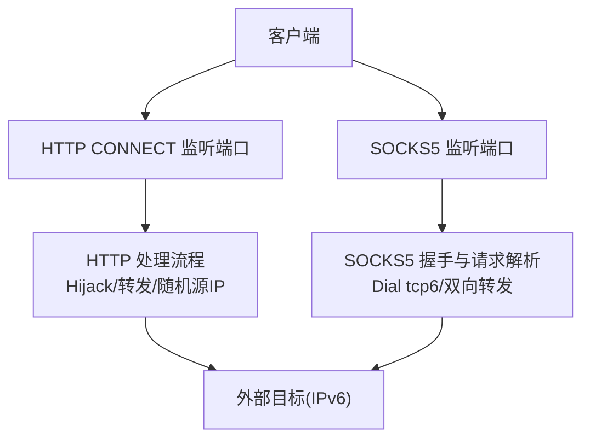
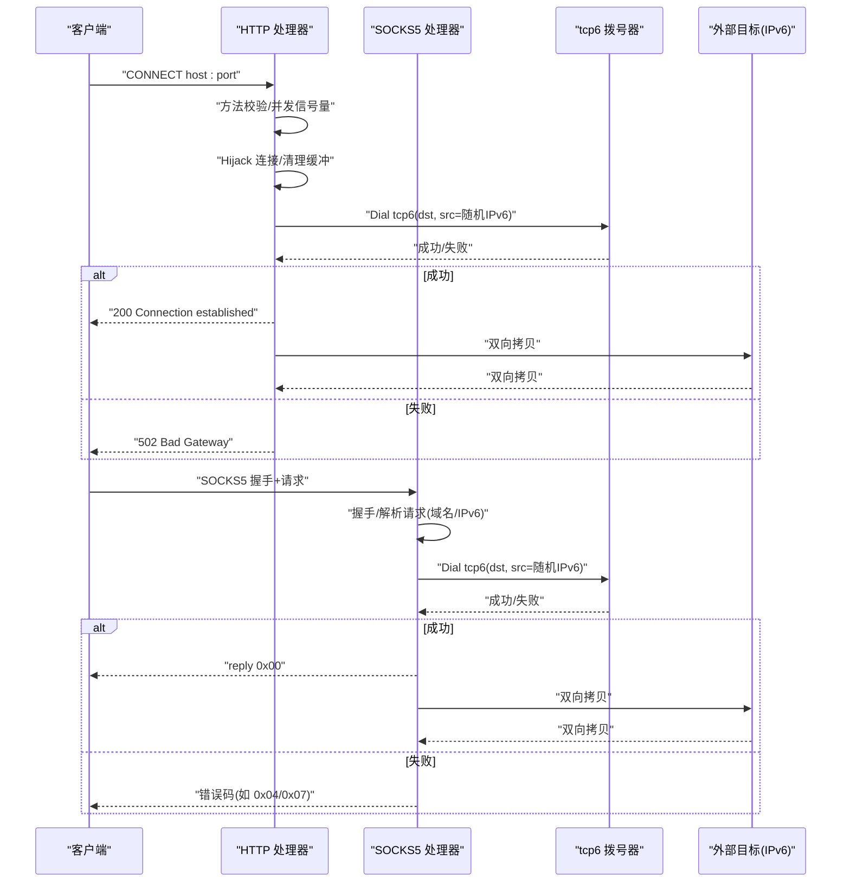
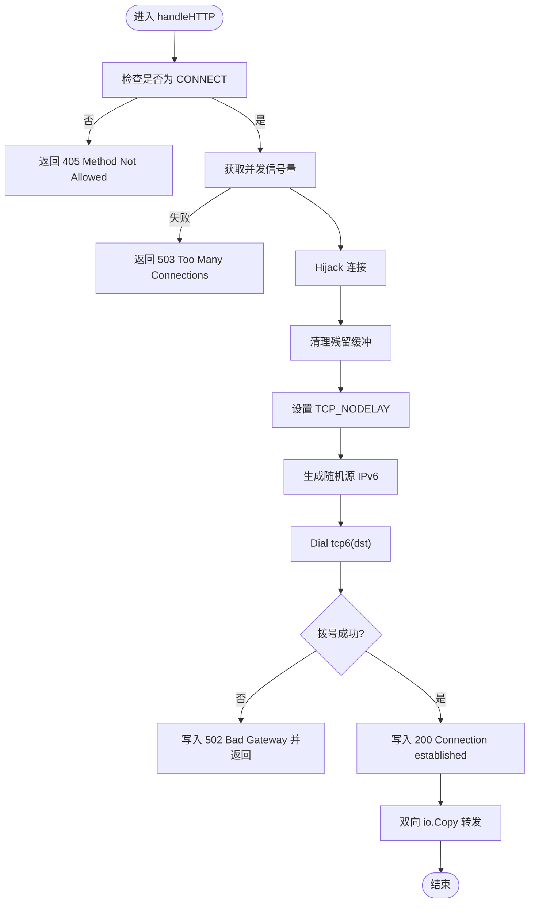
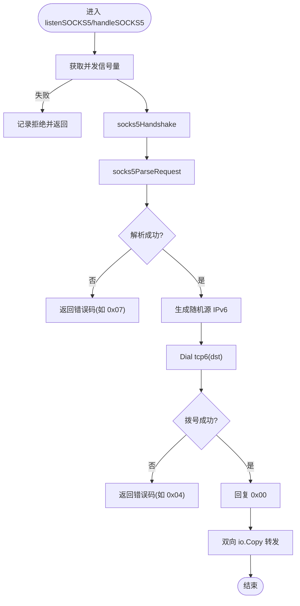
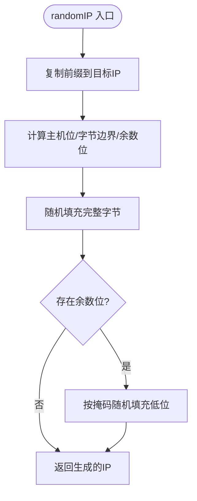

# 故障排除

<cite>
**本文引用的文件**   
- [main.go](file://main.go)
- [REDME.md](file://REDME.md)
- [install.sh](file://scripts/install.sh)
- [gen_cert.sh](file://scripts/gen_cert.sh)
</cite>

## 目录
1. [简介](#简介)
2. [项目结构](#项目结构)
3. [核心组件](#核心组件)
4. [架构总览](#架构总览)
5. [详细组件分析](#详细组件分析)
6. [依赖关系分析](#依赖关系分析)
7. [性能与容量规划](#性能与容量规划)
8. [常见问题与解决方案](#常见问题与解决方案)
9. [日志分析方法](#日志分析方法)
10. [网络调试技巧与工具](#网络调试技巧与工具)
11. [生产监控与告警建议](#生产监控与告警建议)
12. [结论](#结论)

## 简介
本指南面向部署和运维 IPv6 代理池服务的工程师，聚焦于“问题定位—根因分析—解决验证”的闭环。内容覆盖网络连接、权限配置、并发限流、系统内核参数、ndppd 邻居代理、日志分析与性能诊断等关键主题，并提供可操作的命令与指标建议，帮助快速恢复服务并建立完善的监控体系。

## 项目结构
仓库包含一个 Go 主程序、安装脚本与证书生成脚本，以及 systemd 目录（用于服务管理）。主程序提供 HTTP CONNECT 与 SOCKS5 两种代理能力，强制使用 IPv6 出口，并通过信号量实现并发限制。

图表来源
- [main.go:48-76](file://main.go#L48-L76)
- [main.go:108-197](file://main.go#L108-L197)
- [main.go:201-274](file://main.go#L201-L274)

章节来源
- [main.go:1-76](file://main.go#L1-L76)
- [REDME.md:1-25](file://REDME.md#L1-L25)

## 核心组件
- 进程入口与参数解析：定义 HTTP/SOCKS5 监听地址、IPv6 前缀、最大并发数等参数，并在启动时校验前缀合法性。
- 并发控制：通过带缓冲通道实现的信号量，限制同时转发的连接数，避免资源耗尽。
- HTTP CONNECT 代理：劫持连接、清空残留缓冲、设置 TCP_NODELAY、基于随机源 IP 发起 tcp6 拨号、双向拷贝数据。
- SOCKS5 代理：完成握手、解析请求（仅支持域名或 IPv6）、拨号 tcp6、返回响应并双向转发。
- 随机源 IP 生成：在给定前缀范围内按位掩码随机填充主机位，保证同一 /64 下多实例互不冲突。

章节来源
- [main.go:17-43](file://main.go#L17-L43)
- [main.go:78-104](file://main.go#L78-L104)
- [main.go:108-197](file://main.go#L108-L197)
- [main.go:201-274](file://main.go#L201-L274)
- [main.go:276-346](file://main.go#L276-L346)

## 架构总览
下图展示了从客户端到外部目标的完整调用链，包括协议处理、并发控制、随机源 IP 选择与 tcp6 拨号路径。

图表来源
- [main.go:108-197](file://main.go#L108-L197)
- [main.go:201-274](file://main.go#L201-L274)
- [main.go:276-346](file://main.go#L276-L346)

## 详细组件分析

### HTTP CONNECT 代理
- 关键点
  - 仅接受 CONNECT 方法，否则返回方法不允许。
  - 使用 Hijacker 接管底层连接，确保透传二进制数据。
  - 清理可能残留的缓冲数据，避免误读。
  - 设置 TCP_NODELAY 降低小包延迟。
  - 基于随机源 IP 进行 tcp6 拨号，失败返回 502。
  - 双向 io.Copy 完成后关闭两端连接。
- 常见异常点
  - 未启用 ip_nonlocal_bind 导致绑定随机源 IP 失败。
  - 路由缺失导致无法将本地前缀作为源地址出站。
  - 并发超限触发“too many connections”。

图表来源
- [main.go:108-197](file://main.go#L108-L197)

章节来源
- [main.go:108-197](file://main.go#L108-L197)

### SOCKS5 代理
- 关键点
  - 握手阶段仅接受无认证方式。
  - 请求解析仅支持域名与 IPv6 地址类型，拒绝 IPv4。
  - 拨号同样使用 tcp6，失败返回相应错误码。
  - 成功后回复 0x00 并进入双向转发。
- 常见异常点
  - 客户端发送 IPv4 地址被拒绝。
  - 握手或请求解析读取不完整导致错误。
  - 并发超限直接拒绝连接。

图表来源
- [main.go:201-274](file://main.go#L201-L274)
- [main.go:276-346](file://main.go#L276-L346)

章节来源
- [main.go:201-274](file://main.go#L201-L274)
- [main.go:276-346](file://main.go#L276-L346)

### 随机源 IP 生成
- 算法要点
  - 复制前缀部分，计算主机位长度与字节边界。
  - 对完整字节范围随机填充，剩余低位按掩码随机。
  - 使用互斥锁保护随机状态，避免竞争。
- 注意事项
  - 前缀必须合法；若为 /64，主机位较大，随机空间充足。
  - 在同一 /64 下多实例共享前缀时，需确保实例间隔离（例如不同进程/命名空间）。

图表来源
- [main.go:78-104](file://main.go#L78-L104)

章节来源
- [main.go:78-104](file://main.go#L78-L104)

## 依赖关系分析
- 运行时依赖
  - Go 标准库：net/http、net、io、sync、log、flag、time、encoding/binary、errors、math/rand。
  - 操作系统：Linux 内核 IPv6 栈、ndppd（邻居代理）、systemd（服务管理）。
- 外部集成
  - 可与 v2ray/xray 配合，通过 smux 聚合缓解 conntrack 压力（参考说明文档）。

章节来源
- [main.go:1-15](file://main.go#L1-L15)
- [REDME.md:1-12](file://REDME.md#L1-L12)

## 性能与容量规划
- 并发上限
  - 通过命令行参数限制最大并发连接数，建议根据 CPU 核数、内存与目标链路带宽评估。
- 随机源 IP 空间
  - /112 子网提供 2^16 个可用地址，适合小规模多实例隔离；/64 提供更大空间但需注意邻居表与 ARP/NDP 开销。
- 内核参数优化
  - 启用非本地绑定、转发、调整 NDP 阈值、缩短 FIN_WAIT 超时、扩大本地端口范围等，详见安装脚本与说明文档。
- 连接复用
  - 结合上层隧道/复用层（如 smux）减少短连接数量，降低路由器 conntrack 压力。

章节来源
- [main.go:17-22](file://main.go#L17-L22)
- [main.go:78-104](file://main.go#L78-L104)
- [install.sh:73-85](file://scripts/install.sh#L73-L85)
- [REDME.md:28-57](file://REDME.md#L28-L57)

## 常见问题与解决方案

### 网络连接问题
- 症状
  - 客户端无法通过代理访问目标；日志出现拨号失败或 502。
- 排查步骤
  - 确认本机已分配所需 IPv6 前缀，且具备足够的主机位空间。
  - 添加本地路由使前缀生效（见安装脚本提示）。
  - 检查 ndppd 是否运行并正确配置对应网段规则。
  - 验证防火墙/安全组放行代理端口及出站 IPv6 流量。
  - 使用 ping6 测试可达性，使用 ss/netstat 查看连接状态。
- 相关依据
  - 安装脚本会输出下一步操作提示，包括本地路由与 ndppd 配置。
  - 主程序拨号使用 tcp6，IPv4-only 目标将被拒绝。

章节来源
- [install.sh:92-101](file://scripts/install.sh#L92-L101)
- [REDME.md:55-77](file://REDME.md#L55-L77)
- [main.go:164-169](file://main.go#L164-L169)
- [main.go:247-252](file://main.go#L247-L252)

### 权限与配置错误
- 症状
  - 启动失败、无法绑定端口、无法绑定随机源 IP。
- 排查步骤
  - 以 root 权限运行安装脚本与服务。
  - 确认 net.ipv6.ip_nonlocal_bind=1 已生效。
  - 确认本地路由已添加且接口名称正确。
  - 检查配置文件路径与权限（安装脚本会创建目录与示例配置）。
- 相关依据
  - 安装脚本要求 root 权限，并写入 sysctl 配置。
  - 说明文档给出内核参数与本地路由配置示例。

章节来源
- [install.sh:30-34](file://scripts/install.sh#L30-L34)
- [install.sh:73-85](file://scripts/install.sh#L73-L85)
- [REDME.md:28-57](file://REDME.md#L28-L57)

### 并发与资源耗尽
- 症状
  - 大量连接被拒绝，日志显示“too many connections”或 503。
- 排查步骤
  - 调大并发限制参数（-c），并结合系统资源评估上限。
  - 观察系统负载、内存占用与文件描述符使用量。
  - 检查是否存在长连接堆积或慢下游导致的资源占用。
- 相关依据
  - 主程序使用信号量限制并发，超限直接拒绝。

章节来源
- [main.go:126-133](file://main.go#L126-L133)
- [main.go:221-227](file://main.go#L221-L227)

### 协议兼容性问题
- 症状
  - SOCKS5 客户端报错不支持的地址类型或命令。
- 排查步骤
  - 确认客户端发送的是域名或 IPv6 地址，而非 IPv4。
  - 检查握手报文是否正确（版本、方法列表）。
- 相关依据
  - 解析逻辑明确拒绝 IPv4 与不支持的命令。

章节来源
- [main.go:293-336](file://main.go#L293-L336)

### TLS 证书相关问题（与 v2ray/xray 集成）
- 症状
  - 证书校验失败、CN/SAN 不匹配。
- 排查步骤
  - 使用自签证书生成脚本生成证书，注意 CN 与 SAN 设置。
  - 确保证书与私钥权限正确，路径一致。
- 相关依据
  - 脚本默认使用当前公网 IPv4 作为 CN，并添加 SAN。

章节来源
- [gen_cert.sh:10-27](file://scripts/gen_cert.sh#L10-L27)
- [gen_cert.sh:28-38](file://scripts/gen_cert.sh#L28-L38)

## 日志分析方法
- 日志位置
  - 使用 systemd 管理的进程可通过 journalctl 查看。
- 关键字段与含义
  - [HTTP] 请求方法与 URL：用于识别入站请求。
  - [HTTP-OK]/[HTTP-FAIL]：拨号结果与使用的随机源 IP，便于追踪出口 IP。
  - [SOCKS5] accept/handshake/request/reply：握手与请求解析过程。
  - [SOCKS5-OK]/[SOCKS5-FAIL]：拨号结果与出口 IP。
- 常用过滤
  - 按时间窗口筛选最近错误。
  - 按关键词过滤失败与拒绝信息。
  - 结合客户端 IP 与目标地址进行关联分析。
- 典型思路
  - 先定位失败阶段（握手/解析/拨号/转发），再结合系统指标与网络工具进一步分析。

章节来源
- [main.go:108-197](file://main.go#L108-L197)
- [main.go:201-274](file://main.go#L201-L274)
- [install.sh:92-101](file://scripts/install.sh#L92-L101)

## 网络调试技巧与工具
- 连通性与路由
  - ping6 测试 IPv6 可达性。
  - ip route show 检查本地路由与前缀绑定。
- 连接与端口
  - ss -tulnp | grep 代理端口，确认监听正常。
  - ss -tnp state established | grep 代理端口，查看活跃连接数。
- 抓包分析
  - tcpdump 抓取代理端口流量，结合 -nn 禁用解析提升性能。
  - 针对特定源/目的 IP 与端口过滤，缩小范围。
- 邻居与 NDP
  - ndptool 或 ip -6 neigh 查看邻居表，结合 ndppd 配置判断学习是否正常。
- 内核参数
  - sysctl 查看与临时修改关键参数，确认生效。

章节来源
- [install.sh:73-85](file://scripts/install.sh#L73-L85)
- [REDME.md:55-77](file://REDME.md#L55-L77)

## 生产监控与告警建议
- 进程与系统指标
  - 进程存活与重启次数（systemd 状态）。
  - CPU、内存、文件描述符、打开句柄数。
  - 网络 I/O 速率、丢包率、重传率。
- 应用指标
  - 入站请求总量、成功率、失败原因分布（握手/解析/拨号/转发）。
  - 并发连接数与队列等待情况（接近 -c 限制时的拒绝比例）。
  - 平均/分位延迟（握手、拨号、端到端）。
- 告警策略
  - 连续失败率超过阈值（如 5%）持续 N 分钟。
  - 拒绝连接比例上升（too many connections）。
  - 拨号失败率升高（网络不可达或目标不可用）。
  - 系统资源告警（CPU/内存/FD 使用率）。
- 采集与可视化
  - 使用 Node Exporter + Prometheus + Grafana 采集系统与应用指标。
  - 将关键指标面板化，设置分级告警（警告/严重）。

[本节为通用建议，无需代码引用]

## 结论
通过理解代理的核心流程（HTTP CONNECT 与 SOCKS5）、掌握日志关键字段、结合系统与网络工具进行分层排查，并建立完善的监控与告警体系，可以显著提升故障定位效率与系统稳定性。建议在上线前完成内核参数优化、ndppd 配置验证与压测，确保在高并发场景下的稳定表现。