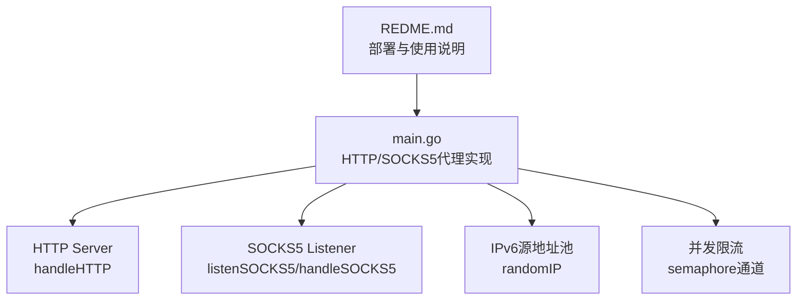
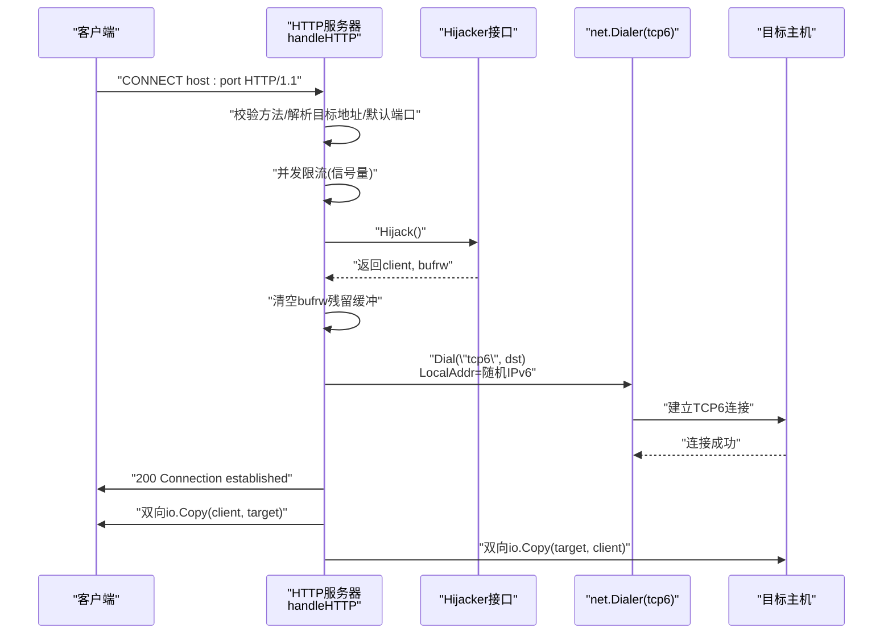
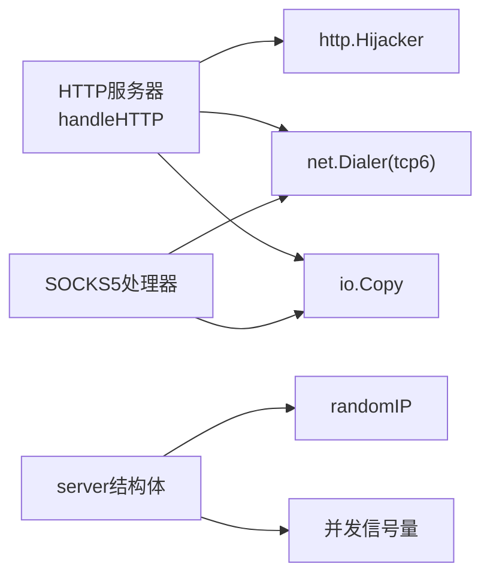

# HTTP CONNECT代理

<cite>
**本文引用的文件**   
- [main.go](file://main.go)
- [REDME.md](file://REDME.md)
</cite>

## 目录
1. [简介](#简介)
2. [项目结构](#项目结构)
3. [核心组件](#核心组件)
4. [架构总览](#架构总览)
5. [详细组件分析](#详细组件分析)
6. [依赖关系分析](#依赖关系分析)
7. [性能考虑](#性能考虑)
8. [故障排查指南](#故障排查指南)
9. [结论](#结论)
10. [附录](#附录)

## 简介
本技术文档聚焦于HTTP CONNECT代理功能的实现与原理，围绕以下关键点展开：
- HTTP CONNECT隧道的工作原理与请求解析流程
- 连接劫持机制的实现细节（Hijacker接口、缓冲数据处理）
- 双向数据转发的处理逻辑
- handleHTTP函数的完整实现要点（方法验证、目标地址解析、默认端口、错误响应）
- IPv6强制出口的实现方式（Dialer配置、tcp6拨号、源IP绑定）
- 性能调优建议（NoDelay、超时、并发控制）
- 代码示例路径与故障排查指引

该实现为纯Go语言，零外部依赖，支持HTTP CONNECT与SOCKS5双协议，并通过随机IPv6源地址池进行强制IPv6出口。

## 项目结构
仓库包含一个主程序入口与说明文档：
- main.go：服务启动、HTTP CONNECT与SOCKS5处理逻辑、IPv6源地址生成、并发限流等
- REDME.md：快速开始、系统参数配置、ndppd配置、编译运行与测试命令



图表来源
- [main.go:31-76](file://main.go#L31-L76)
- [main.go:108-197](file://main.go#L108-L197)
- [main.go:201-274](file://main.go#L201-L274)
- [main.go:78-104](file://main.go#L78-L104)
- [REDME.md:1-98](file://REDME.md#L1-L98)

章节来源
- [main.go:1-347](file://main.go#L1-L347)
- [REDME.md:1-98](file://REDME.md#L1-L98)

## 核心组件
- server结构体：持有IPv6前缀网络、随机数生成器、互斥锁与并发信号量
- randomIP：在给定IPv6前缀范围内生成随机源IP，用于出站连接
- handleHTTP：HTTP CONNECT代理的核心处理函数
- listenSOCKS5/handleSOCKS5：SOCKS5代理监听与处理
- socks5Handshake/socks5ParseRequest/socks5Reply：SOCKS5握手与请求解析

章节来源
- [main.go:24-29](file://main.go#L24-L29)
- [main.go:78-104](file://main.go#L78-L104)
- [main.go:108-197](file://main.go#L108-L197)
- [main.go:201-274](file://main.go#L201-L274)
- [main.go:276-346](file://main.go#L276-L346)

## 架构总览
整体架构由HTTP服务器与SOCKS5监听组成，两者共享server实例以复用IPv6源地址池与并发限流。HTTP CONNECT通过Hijacker接管底层TCP连接，随后使用tcp6拨号到目标并建立双向转发。



图表来源
- [main.go:108-197](file://main.go#L108-L197)
- [main.go:158-174](file://main.go#L158-L174)

## 详细组件分析

### HTTP CONNECT隧道工作原理
- 请求解析流程
  - 仅接受CONNECT方法，否则返回405
  - 目标地址优先取自r.Host；若为空则回退到r.URL.Host
  - 若未显式指定端口，则补全为443
- 连接劫持机制
  - 通过http.Hijacker接管底层连接，获取client与带缓冲的读写器bufrw
  - 清空bufrw中可能残留的请求头或数据，避免污染后续应用层数据
- 双向数据转发
  - 发送“200 Connection established”后，开启两个goroutine分别执行io.Copy(client, target)与io.Copy(target, client)，直至任一端关闭

```mermaid
flowchart TD
Start["进入handleHTTP"] --> CheckMethod["检查HTTP方法是否为CONNECT"]
CheckMethod --> |否| Return405["返回405 Method Not Allowed"]
CheckMethod --> |是| ParseHost["解析目标地址<br/>优先r.Host，其次r.URL.Host"]
ParseHost --> HasPort{"是否包含端口?"}
HasPort --> |否| AddDefaultPort["追加默认端口443"]
HasPort --> |是| Semaphore["尝试获取并发信号量"]
AddDefaultPort --> Semaphore
Semaphore --> TooMany{"超过并发限制?"}
TooMany --> |是| Return503["返回503 Service Unavailable"]
TooMany --> |否| Hijack["Hijacker.Hijack()"]
Hijack --> HijackErr{"劫持失败?"}
HijackErr --> |是| Return500["返回500 Internal Server Error"]
HijackErr --> |否| ClearBuf["清空bufrw残留缓冲"]
ClearBuf --> SetNoDelayClient["设置客户端TCP NoDelay"]
SetNoDelayClient --> RandomSrc["生成随机IPv6源地址"]
RandomSrc --> Dialer["创建Dialer(LocalAddr=随机IPv6, Timeout=30s)"]
Dialer --> DialTCP6["Dial(\"tcp6\", dst)"]
DialTCP6 --> DialOK{"拨号成功?"}
DialOK --> |否| Write502["写入502 Bad Gateway并返回"]
DialOK --> |是| SetNoDelayRemote["设置远端TCP NoDelay"]
SetNoDelayRemote --> Send200["写入200 Connection established"]
Send200 --> Relay["双向io.Copy转发"]
Relay --> End["结束"]
```

图表来源
- [main.go:108-197](file://main.go#L108-L197)

章节来源
- [main.go:108-197](file://main.go#L108-L197)

### handleHTTP函数实现要点
- 方法验证
  - 非CONNECT直接拒绝，返回405
- 目标地址解析与默认端口
  - r.Host优先；为空时回退r.URL.Host
  - 无端口时自动补全443
- 并发控制
  - 使用chan作为信号量，超限返回503
- 连接劫持与缓冲清理
  - 使用http.Hijacker获取底层连接与缓冲读写器
  - 清空缓冲以避免残留数据影响后续转发
- TCP优化
  - 对客户端与远端TCP连接设置NoDelay(true)
- 错误响应机制
  - 劫持失败返回500
  - 拨号失败返回502
  - 并发超限返回503
  - 方法不合法返回405

章节来源
- [main.go:108-197](file://main.go#L108-L197)

### 连接劫持关键步骤
- Hijacker接口使用
  - 通过类型断言w.(http.Hijacker)判断是否支持
  - 调用Hijack()返回client与bufrw
- 缓冲数据处理
  - 读取bufrw.Reader.Buffered()长度，使用io.CopyN丢弃残留数据
- TCP连接优化设置
  - 将client与远端连接转换为*net.TCPConn并设置SetNoDelay(true)

章节来源
- [main.go:136-155](file://main.go#L136-L155)
- [main.go:172-174](file://main.go#L172-L174)

### IPv6强制出口实现
- Dialer配置
  - LocalAddr设置为随机生成的IPv6地址，端口0表示系统分配
  - Timeout设为30秒
- tcp6拨号
  - 使用Dial("tcp6", dst)强制走IPv6出站
- 源IP绑定机制
  - randomIP基于配置的IPv6前缀生成随机源IP
  - 同一/64下可划分多个/112子网，避免不同服务器间冲突

章节来源
- [main.go:78-104](file://main.go#L78-L104)
- [main.go:158-164](file://main.go#L158-L164)
- [main.go:164-174](file://main.go#L164-L174)

### 并发控制策略
- 使用channel作为信号量，容量由-c参数决定
- 在HTTP与SOCKS5路径均先尝试获取信号量，失败即拒绝
- 每个连接完成后释放信号量，防止资源耗尽

章节来源
- [main.go:21-22](file://main.go#L21-L22)
- [main.go:39-43](file://main.go#L39-L43)
- [main.go:127-133](file://main.go#L127-L133)
- [main.go:221-227](file://main.go#L221-L227)

## 依赖关系分析
- 标准库依赖
  - net/http：HTTP服务器与Hijacker接口
  - net：TCP监听、拨号、地址解析
  - io：数据拷贝
  - sync：WaitGroup与互斥锁
  - time：超时控制
  - encoding/binary：SOCKS5端口解析
  - math/rand：随机源IP生成
- 模块耦合与内聚
  - server集中管理IPv6源地址与并发限流，提升内聚性
  - HTTP与SOCKS5两条路径共享server，降低重复代码



图表来源
- [main.go:108-197](file://main.go#L108-L197)
- [main.go:201-274](file://main.go#L201-L274)
- [main.go:78-104](file://main.go#L78-L104)

章节来源
- [main.go:1-347](file://main.go#L1-L347)

## 性能考虑
- NoDelay设置
  - 对客户端与远端TCP连接启用NoDelay，减少小包延迟
- 超时配置
  - Dialer.Timeout=30s，避免长时间挂起占用资源
- 并发控制
  - 通过-c参数调整最大并发连接数，防止内存与文件描述符耗尽
- 缓冲区清理
  - 劫持后立即清空bufrw残留，避免额外拷贝与误读
- 日志与监控
  - 记录成功与失败路径，便于定位问题与统计指标

章节来源
- [main.go:153-155](file://main.go#L153-L155)
- [main.go:172-174](file://main.go#L172-L174)
- [main.go:159-162](file://main.go#L159-L162)
- [main.go:149-151](file://main.go#L149-L151)
- [main.go:110](file://main.go#L110)
- [main.go:166-176](file://main.go#L166-L176)

## 故障排查指南
- 常见错误码与原因
  - 405 Method Not Allowed：请求方法不是CONNECT
  - 503 Service Unavailable：并发连接数超过限制
  - 500 Internal Server Error：不支持Hijacker或劫持失败
  - 502 Bad Gateway：tcp6拨号失败（目标不可达、DNS解析失败、路由问题）
- 排查步骤
  - 确认HTTP端口与SOCKS5端口是否正确监听
  - 检查-prefix参数对应的IPv6前缀与本地路由配置
  - 查看内核参数net.ipv6.ip_nonlocal_bind与ndppd配置是否生效
  - 观察日志中的[HTTP-FAIL]与[SOCKS5-FAIL]信息，定位具体dst与src
- 参考命令
  - 使用curl --proxy与--socks5进行测试
  - 使用ip addr与ip route检查IPv6地址与本地路由

章节来源
- [main.go:112-115](file://main.go#L112-L115)
- [main.go:127-133](file://main.go#L127-L133)
- [main.go:136-145](file://main.go#L136-L145)
- [main.go:164-169](file://main.go#L164-L169)
- [REDME.md:26-98](file://REDME.md#L26-L98)

## 结论
该HTTP CONNECT代理实现简洁高效，具备以下优势：
- 明确的请求解析与错误响应机制
- 可靠的连接劫持与缓冲清理
- 强制IPv6出口与随机源IP池，利于负载均衡与隔离
- 完善的并发限流与性能优化点
结合README的系统级配置建议，可在生产环境中稳定运行。

## 附录
- 代码示例路径
  - HTTP CONNECT处理：[main.go:108-197](file://main.go#L108-L197)
  - IPv6源地址生成：[main.go:78-104](file://main.go#L78-L104)
  - 并发限流与错误响应：[main.go:127-133](file://main.go#L127-L133)、[main.go:164-169](file://main.go#L164-L169)
  - 系统配置与测试命令：[REDME.md:26-98](file://REDME.md#L26-L98)