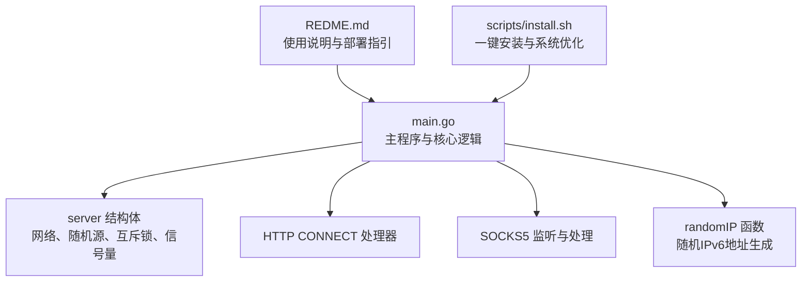
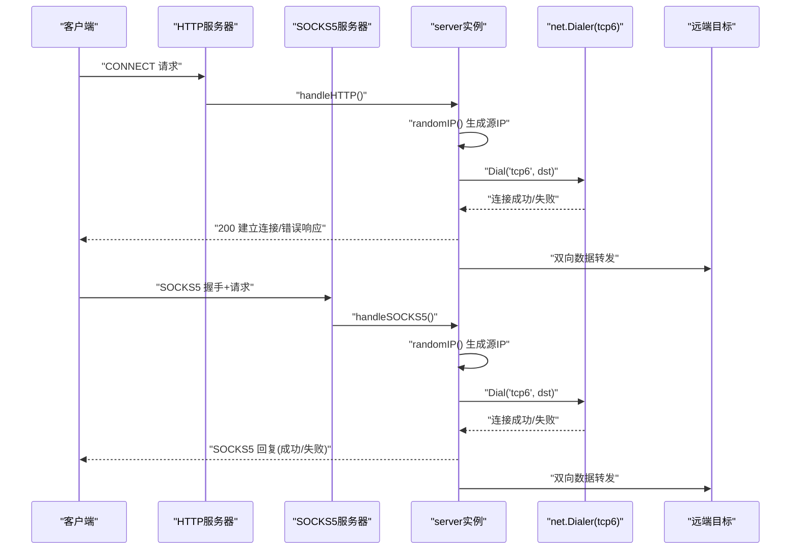
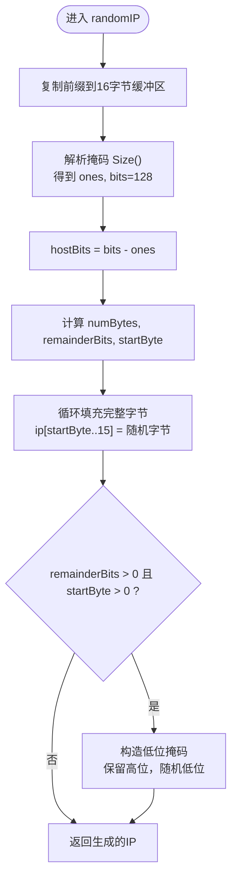
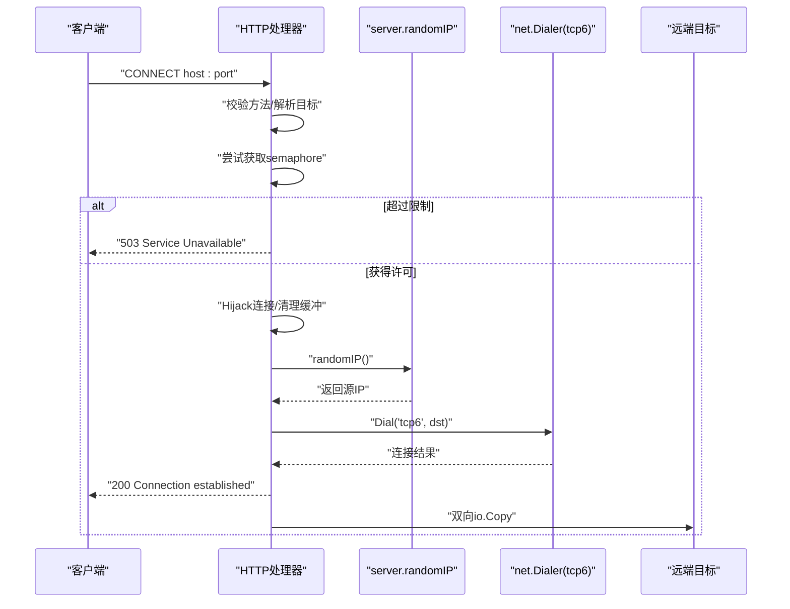
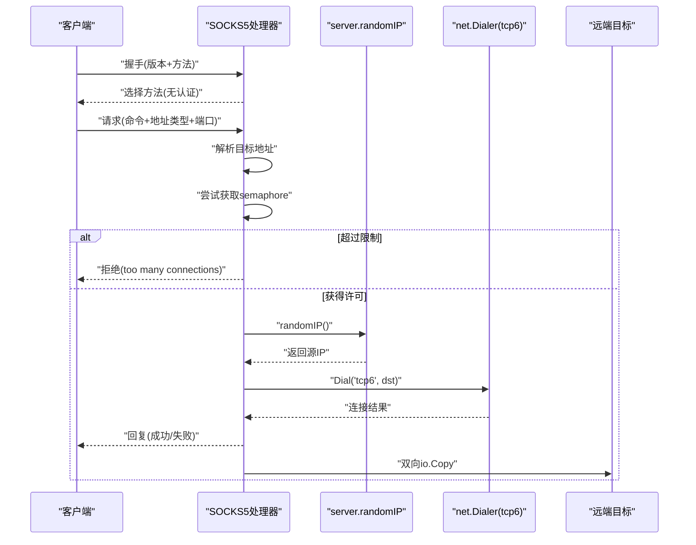
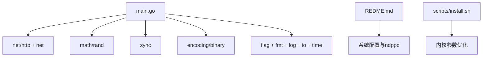

# IPv6地址池管理

<cite>
**本文引用的文件**
- [main.go](file://main.go)
- [REDME.md](file://REDME.md)
- [install.sh](file://scripts/install.sh)
</cite>

## 目录
1. [简介](#简介)
2. [项目结构](#项目结构)
3. [核心组件](#核心组件)
4. [架构总览](#架构总览)
5. [详细组件分析](#详细组件分析)
6. [依赖关系分析](#依赖关系分析)
7. [性能与容量评估](#性能与容量评估)
8. [故障排查指南](#故障排查指南)
9. [结论](#结论)
10. [附录：最佳实践与示例](#附录最佳实践与示例)

## 简介
本项目是一个基于IPv6的代理出口池，支持HTTP CONNECT与SOCKS5两种协议，强制使用IPv6出站。其核心能力在于根据配置的IPv6前缀（如/112或/64）动态生成随机源IP，并通过并发限流机制控制连接数，避免资源耗尽。文档将深入解析randomIP函数的算法细节、数学原理、并发安全保证、不同子网掩码的处理差异、地址分布均匀性与随机性保障，并提供容量评估、性能测试方法与扩展建议。

## 项目结构
仓库包含一个主程序入口、安装脚本与说明文档。核心逻辑集中在单一文件中，便于理解与维护。

图表来源
- [main.go:1-76](file://main.go#L1-L76)
- [main.go:78-104](file://main.go#L78-L104)
- [main.go:108-197](file://main.go#L108-L197)
- [main.go:201-274](file://main.go#L201-L274)
- [REDME.md:1-25](file://REDME.md#L1-L25)
- [install.sh:73-85](file://scripts/install.sh#L73-L85)

章节来源
- [main.go:1-76](file://main.go#L1-L76)
- [REDME.md:1-25](file://REDME.md#L1-L25)
- [install.sh:73-85](file://scripts/install.sh#L73-L85)

## 核心组件
- server结构体：持有IPv6网络前缀、随机数生成器、互斥锁与并发信号量。
- randomIP函数：在给定CIDR前缀范围内生成随机IPv6地址，确保主机位随机填充且保持字节边界对齐。
- HTTP CONNECT处理器：实现CONNECT隧道转发，强制tcp6出站，并注入随机源IP。
- SOCKS5处理器：实现握手、请求解析与数据双向转发，同样注入随机源IP。
- 并发控制：通过channel实现的semaphore限制最大并发连接数。

章节来源
- [main.go:24-29](file://main.go#L24-L29)
- [main.go:78-104](file://main.go#L78-L104)
- [main.go:108-197](file://main.go#L108-L197)
- [main.go:201-274](file://main.go#L201-L274)

## 架构总览
整体流程包括服务启动、协议监听、请求处理、随机源IP生成与出站拨号。

图表来源
- [main.go:108-197](file://main.go#L108-L197)
- [main.go:201-274](file://main.go#L201-L274)
- [main.go:78-104](file://main.go#L78-L104)

## 详细组件分析

### randomIP函数：算法与数学原理
randomIP负责在给定CIDR前缀范围内生成随机IPv6地址。其关键步骤如下：
- CIDR前缀解析：从server.network.Mask.Size()获取ones与bits（IPv6固定为128）。
- 主机位计算：hostBits = bits - ones。
- 字节边界对齐：numBytes = hostBits / 8；remainderBits = hostBits % 8；startByte = 16 - numBytes。
- 完整字节随机填充：对ip[startByte..15]逐字节随机赋值。
- 剩余位处理：当remainderBits > 0且startByte > 0时，对startByte-1字节进行掩码操作，保留高位，仅低位随机填充。

该算法保证了：
- 前缀部分保持不变，仅主机位被随机化。
- 字节边界对齐避免了跨字节的复杂位运算。
- 剩余位的掩码精确控制随机范围，不破坏高位的固定前缀。

图表来源
- [main.go:78-104](file://main.go#L78-L104)

章节来源
- [main.go:78-104](file://main.go#L78-L104)

#### 子网掩码支持与/112与/64的差异
- /112子网：主机位为16位，对应两个完整字节随机填充，无剩余位处理。
- /64子网：主机位为64位，对应八个完整字节随机填充，无剩余位处理。
- 其他非整字节边界的前缀（例如/119）：存在剩余位，需要对起始字节进行掩码操作，仅随机低位。

因此，randomIP通用地支持任意合法前缀长度，并在需要时对起始字节进行掩码处理。

章节来源
- [main.go:78-104](file://main.go#L78-L104)

#### 并发安全保证机制
- 互斥锁：randomIP内部使用sync.Mutex保护共享状态（network与rnd），避免并发竞争。
- 线程安全的随机数生成：每个server实例拥有独立的rand.Rand，避免全局随机源的竞争开销。
- 内存分配优化：每次调用创建16字节缓冲区并拷贝前缀，随后就地修改主机位，减少额外对象创建。

注意：当前实现中互斥锁粒度覆盖整个randomIP过程，在高并发场景可能成为瓶颈。可考虑每goroutine本地缓存随机缓冲或使用更细粒度的锁策略。

章节来源
- [main.go:24-29](file://main.go#L24-L29)
- [main.go:78-104](file://main.go#L78-L104)

#### 地址分布的均匀性与随机性保证
- 均匀性：每个主机位独立等概率随机取值，保证所有有效地址出现概率相同。
- 随机性：使用time.Now().UnixNano()作为种子，避免重复序列；Intn提供均匀分布。
- 边界条件：对于非整字节边界的前缀，掩码确保仅低位随机，不会污染前缀高位。

章节来源
- [main.go:78-104](file://main.go#L78-L104)

### HTTP CONNECT处理器
- 方法校验：仅允许CONNECT方法。
- 目标地址解析：优先使用r.Host，缺失端口时默认443。
- 并发控制：通过semaphore限制最大并发连接，超出则拒绝。
- 连接劫持：Hijack底层TCP连接，清空残留缓冲，设置NoDelay。
- 随机源IP：调用randomIP生成源IP，使用tcp6拨号。
- 双向转发：使用WaitGroup协调两路io.Copy。

图表来源
- [main.go:108-197](file://main.go#L108-L197)
- [main.go:78-104](file://main.go#L78-L104)

章节来源
- [main.go:108-197](file://main.go#L108-L197)

### SOCKS5处理器
- 监听与接受：tcp监听指定端口，Accept后goroutine处理。
- 握手：读取版本与方法列表，选择无认证。
- 请求解析：支持域名与IPv6地址类型，拒绝IPv4。
- 并发控制：semaphore限制并发。
- 随机源IP与拨号：同HTTP路径，使用tcp6。
- 回复与转发：发送成功/失败回复，双向转发数据。

图表来源
- [main.go:201-274](file://main.go#L201-L274)
- [main.go:78-104](file://main.go#L78-L104)

章节来源
- [main.go:201-274](file://main.go#L201-L274)

## 依赖关系分析
- 标准库依赖：net/http、net、math/rand、sync、encoding/binary、flag、fmt、io、log、time。
- 外部依赖：零外部依赖，纯Go实现。
- 系统层依赖：ndppd用于IPv6邻居代理，内核参数优化用于提升连接处理能力。

图表来源
- [main.go:1-15](file://main.go#L1-L15)
- [REDME.md:28-57](file://REDME.md#L28-L57)
- [install.sh:73-85](file://scripts/install.sh#L73-L85)

章节来源
- [main.go:1-15](file://main.go#L1-L15)
- [REDME.md:28-57](file://REDME.md#L28-L57)
- [install.sh:73-85](file://scripts/install.sh#L73-L85)

## 性能与容量评估

### 地址池容量评估
- /112子网：主机位16位，可用地址空间为2^16 = 65536个唯一源IP。
- /64子网：主机位64位，可用地址空间为2^64个唯一源IP，理论上足够大。
- 实际并发受限于semaphore大小（-c参数），而非地址空间。

章节来源
- [main.go:78-104](file://main.go#L78-L104)
- [REDME.md:1-25](file://REDME.md#L1-L25)

### 性能测试方法
- 基准测试：使用wrk或ab对HTTP CONNECT进行压测，观察吞吐与延迟。
- 并发压力：逐步增大-c参数，监控CPU、内存与连接数。
- 随机性验证：统计一段时间内源IP分布，验证均匀性。
- 系统指标：关注内核参数（如neigh阈值、tcp_tw_reuse）对性能的影响。

章节来源
- [REDME.md:28-57](file://REDME.md#L28-L57)
- [install.sh:73-85](file://scripts/install.sh#L73-L85)

### 扩展建议
- 随机源优化：引入per-goroutine随机缓冲或轮询池，降低互斥锁竞争。
- 多前缀支持：支持多个CIDR前缀，按权重或轮询选择。
- 健康检查：对远端目标进行健康探测，剔除不可用节点。
- 指标采集：集成Prometheus导出QPS、延迟、错误率等指标。

[本节为一般性指导，无需具体文件引用]

## 故障排查指南
- 无效前缀：启动时报错“invalid prefix”，检查-prefix参数格式。
- 连接过多：返回“too many connections”或“Service Unavailable”，调整-c参数或优化后端。
- 拨号失败：日志显示“FAIL via ...”，检查路由、ndppd配置与远端可达性。
- 内核参数未生效：确认sysctl配置已加载，重启服务或应用sysctl -p。

章节来源
- [main.go:34-37](file://main.go#L34-L37)
- [main.go:127-133](file://main.go#L127-L133)
- [main.go:165-169](file://main.go#L165-L169)
- [main.go:248-252](file://main.go#L248-L252)
- [install.sh:73-85](file://scripts/install.sh#L73-L85)

## 结论
本项目的randomIP函数以简洁高效的算法实现了在任意CIDR前缀范围内的随机IPv6地址生成，结合互斥锁与独立随机源保证并发安全。通过semaphore实现并发限流，配合系统级优化与ndppd，能够在大规模并发场景下稳定运行。/112与/64子网的差异主要体现在主机位数量与地址空间规模上，算法均能正确处理。建议在生产环境中结合指标采集与健康检查进一步提升可靠性与可观测性。

[本节为总结性内容，无需具体文件引用]

## 附录：最佳实践与示例

### 运行与测试示例
- 快速开始：参考README中的命令行示例，分别启用HTTP与SOCKS5端口，指定-prefix与-c参数。
- 手动部署：按照README的步骤配置内核参数、添加本地路由、安装ndppd并编译运行。
- 一键安装：使用install.sh脚本自动完成依赖安装、编译与系统优化。

章节来源
- [REDME.md:13-25](file://REDME.md#L13-L25)
- [REDME.md:79-97](file://REDME.md#L79-L97)
- [install.sh:60-101](file://scripts/install.sh#L60-L101)

### 代码片段路径（不含具体代码）
- randomIP实现：[main.go:78-104](file://main.go#L78-L104)
- HTTP CONNECT处理：[main.go:108-197](file://main.go#L108-L197)
- SOCKS5处理：[main.go:201-274](file://main.go#L201-L274)
- 系统优化配置：[install.sh:73-85](file://scripts/install.sh#L73-L85)