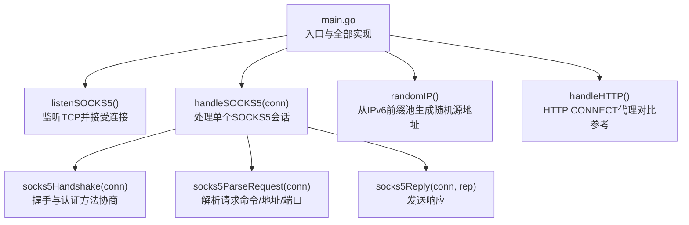
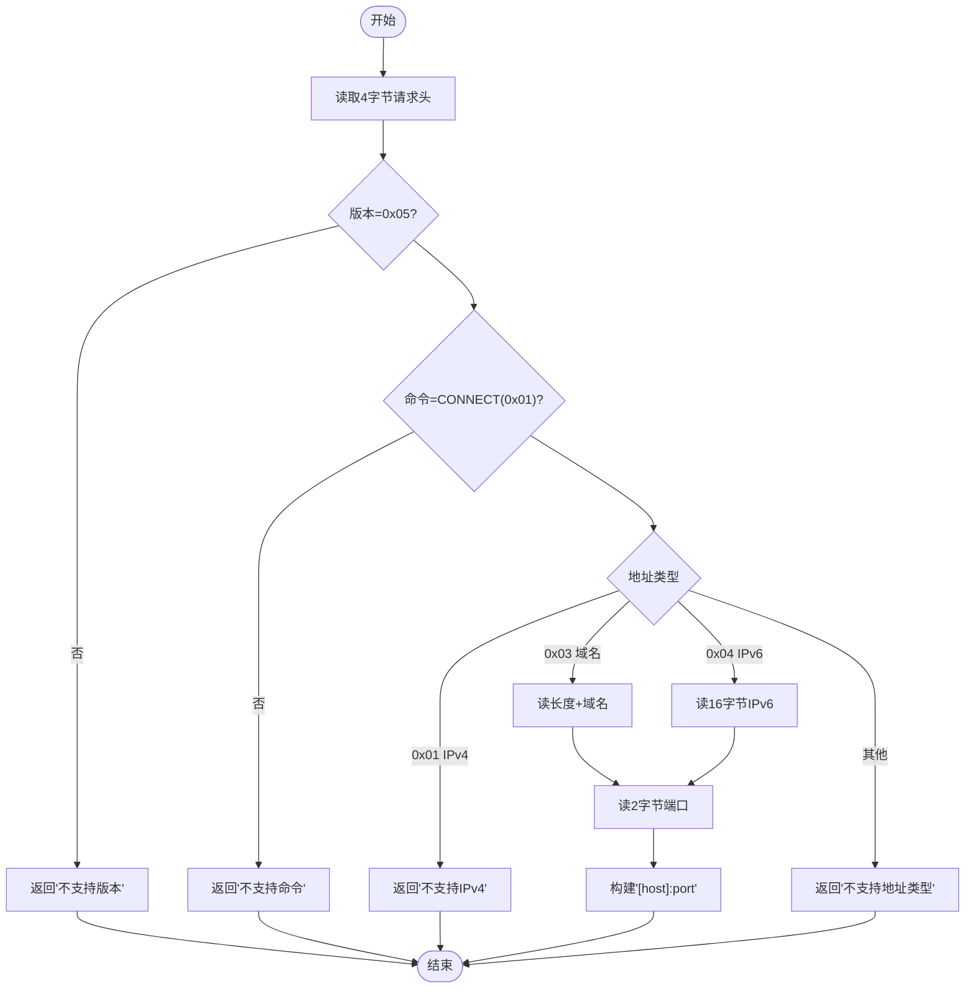
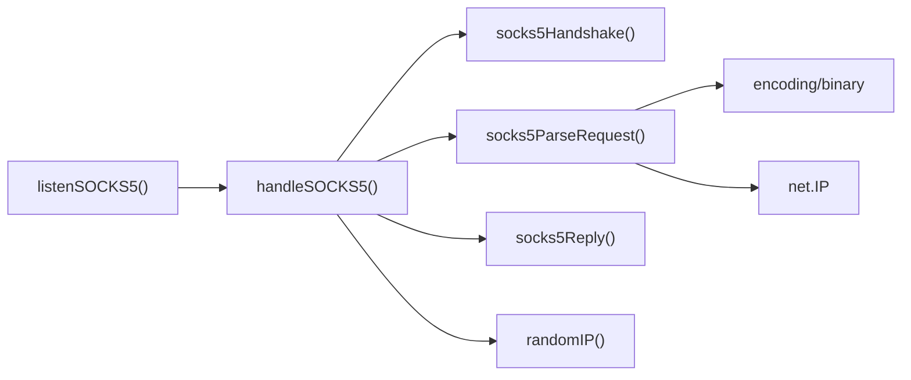

# SOCKS5代理

<cite>
**本文引用的文件**   
- [main.go](file://main.go)
- [REDME.md](file://REDME.md)
</cite>

## 目录
1. [简介](#简介)
2. [项目结构](#项目结构)
3. [核心组件](#核心组件)
4. [架构总览](#架构总览)
5. [详细组件分析](#详细组件分析)
6. [依赖关系分析](#依赖关系分析)
7. [性能考量](#性能考量)
8. [故障排查指南](#故障排查指南)
9. [结论](#结论)
10. [附录](#附录)

## 简介
本项目实现了一个基于 IPv6 前缀池的轻量级代理，同时支持 HTTP CONNECT 与 SOCKS5 两种协议。SOCKS5 部分实现了最小可用版本：仅支持无认证模式、CONNECT 命令、域名与 IPv6 地址类型，并通过随机分配的前缀内 IPv6 源地址进行出站连接，从而提供“强制 IPv6 出口”的能力。

## 项目结构
仓库为单文件实现，所有逻辑集中在 main.go 中；README 提供了运行与部署说明。



图表来源
- [main.go:201-216](file://main.go#L201-L216)
- [main.go:218-274](file://main.go#L218-L274)
- [main.go:276-291](file://main.go#L276-L291)
- [main.go:293-336](file://main.go#L293-L336)
- [main.go:338-346](file://main.go#L338-L346)
- [main.go:78-104](file://main.go#L78-L104)
- [main.go:108-197](file://main.go#L108-L197)

章节来源
- [main.go:1-347](file://main.go#L1-L347)
- [REDME.md:1-98](file://REDME.md#L1-L98)

## 核心组件
- server 结构体
  - 字段包含 IPv6 前缀网络、随机数生成器、互斥锁与并发信号量通道。用于并发限流与随机源地址生成。
- listenSOCKS5()
  - 在指定端口上监听 TCP 连接，进入无限循环 Accept，每接受一个连接即启动 goroutine 交由 handleSOCKS5 处理。
- handleSOCKS5(conn)
  - 负责单个连接的完整生命周期：并发限流、握手、请求解析、建立出站连接、双向数据转发。
- socks5Handshake(conn)
  - 读取客户端的版本与方法列表，校验版本，选择无认证方法并返回协商结果。
- socks5ParseRequest(conn)
  - 解析请求头（版本、命令、保留位、地址类型），根据地址类型分别处理域名或 IPv6，再读取端口，最终拼接成目标地址字符串。
- socks5Reply(conn, rep)
  - 固定格式写入响应包，包含版本、回复码、保留位、地址类型与地址/端口占位。
- randomIP()
  - 基于配置的 IPv6 前缀，按主机位长度随机填充，生成出站源 IP。

章节来源
- [main.go:24-29](file://main.go#L24-L29)
- [main.go:201-216](file://main.go#L201-L216)
- [main.go:218-274](file://main.go#L218-L274)
- [main.go:276-291](file://main.go#L276-L291)
- [main.go:293-336](file://main.go#L293-L336)
- [main.go:338-346](file://main.go#L338-L346)
- [main.go:78-104](file://main.go#L78-L104)

## 架构总览
下图展示了 SOCSK5 代理的整体流程：监听器接受连接后，进入握手、请求解析、出站拨号、成功响应与双向转发的顺序。

```mermaid
sequenceDiagram
participant Client as "SOCKS5客户端"
participant Listener as "listenSOCKS5()"
participant Handler as "handleSOCKS5(conn)"
participant Handshake as "socks5Handshake()"
participant Parser as "socks5ParseRequest()"
participant Dialer as "net.Dialer(tcp6)"
participant Remote as "远端服务器"
Client->>Listener : "TCP连接"
Listener-->>Handler : "Accept() -> conn"
Handler->>Handshake : "握手(版本+方法)"
Handshake-->>Handler : "选择无认证"
Handler->>Parser : "解析请求(命令/地址/端口)"
Parser-->>Handler : "目标地址字符串"
Handler->>Dialer : "Dial('tcp6', dst)"
Dialer-->>Remote : "建立出站连接"
alt 拨号失败
Handler-->>Client : "错误响应(如0x04)"
else 拨号成功
Handler-->>Client : "成功响应(0x00)"
Client<->Remote : "双向数据转发(io.Copy)"
end
```

图表来源
- [main.go:201-216](file://main.go#L201-L216)
- [main.go:218-274](file://main.go#L218-L274)
- [main.go:276-291](file://main.go#L276-L291)
- [main.go:293-336](file://main.go#L293-L336)
- [main.go:338-346](file://main.go#L338-L346)

## 详细组件分析

### 监听与连接接受循环：listenSOCKS5
- 使用 net.Listen("tcp", *socksPort) 创建监听器。
- 进入 for 循环调用 ln.Accept() 接受新连接。
- 每次接受成功后，立即 go s.handleSOCKS5(conn) 启动 goroutine 处理该连接。
- 错误处理：Accept 出错时记录日志并 continue，不中断监听。

章节来源
- [main.go:201-216](file://main.go#L201-L216)

### 连接处理主流程：handleSOCKS5
- 并发控制：通过 channel 作为信号量，拒绝超过限制的请求。
- 握手阶段：调用 socks5Handshake，失败则直接返回。
- 请求解析：调用 socks5ParseRequest，失败则发送错误响应并返回。
- 出站拨号：使用 net.Dialer 以 tcp6 方式拨号到目标地址，并设置超时。
- 成功路径：发送成功响应，随后两路 io.Copy 进行双向数据转发。
- 资源清理：defer 关闭连接，确保 goroutine 退出。

章节来源
- [main.go:218-274](file://main.go#L218-L274)

### 握手与认证方法协商：socks5Handshake
- 读取版本号与方法数量，校验版本必须为 0x05。
- 读取方法列表（长度由客户端声明）。
- 服务端固定选择无认证方法（0x00），并写回协商结果。
- 不支持其他认证方法（如用户名/密码）将导致后续流程无法继续。

章节来源
- [main.go:276-291](file://main.go#L276-L291)

### 请求解析算法：socks5ParseRequest
- 读取请求头四字节：版本、命令、保留位、地址类型。
- 版本检查：必须为 0x05。
- 命令检查：仅支持 CONNECT（0x01），否则返回错误。
- 地址类型分支：
  - 0x01（IPv4）：明确拒绝，返回错误。
  - 0x03（域名）：先读长度字节，再读域名内容。
  - 0x04（IPv6）：读取 16 字节 IPv6 地址。
  - 其他值：返回“不支持的地址类型”。
- 端口解析：读取 2 字节大端序端口。
- 输出目标地址：统一格式化为 "[host]:port"，便于 tcp6 拨号。



图表来源
- [main.go:293-336](file://main.go#L293-L336)

章节来源
- [main.go:293-336](file://main.go#L293-L336)

### 响应处理机制：socks5Reply
- 固定写入响应包：版本、回复码、保留位、地址类型（0x04 表示 IPv6）、地址与端口占位（全零）。
- 成功场景：rep=0x00。
- 错误场景：
  - 0x04：连接被主机或网络拒绝（拨号失败时返回）。
  - 0x07：命令不被允许（请求解析失败时返回）。

章节来源
- [main.go:338-346](file://main.go#L338-L346)

### 源地址分配：randomIP
- 基于配置的 IPv6 前缀，计算主机位长度并按字节随机填充。
- 对不足一字节的部分，使用掩码仅随机低位，保持高位不变。
- 使用互斥锁保护随机数生成器与共享状态，避免竞争。

章节来源
- [main.go:78-104](file://main.go#L78-L104)

### 并发与资源管理
- 全局 semaphore：channel 容量由命令行参数 -c 控制，限制最大并发连接数。
- 每个 handleSOCKS5 在进入时尝试获取信号量，失败则直接拒绝。
- 使用 sync.WaitGroup 等待双向转发 goroutine 完成，确保连接正确关闭。

章节来源
- [main.go:218-274](file://main.go#L218-L274)

## 依赖关系分析
- 外部库
  - net：TCP 监听、拨号、地址类型处理。
  - encoding/binary：大端序端口解析。
  - fmt：格式化目标地址。
  - log：日志输出。
  - time：超时配置。
  - sync：WaitGroup 与互斥锁。
  - math/rand：随机源地址生成。
  - flag：命令行参数解析。
- 内部依赖
  - listenSOCKS5 依赖 handleSOCKS5。
  - handleSOCKS5 依赖 socks5Handshake、socks5ParseRequest、socks5Reply、randomIP。
  - socks5ParseRequest 依赖 encoding/binary 与 net 地址转换。



图表来源
- [main.go:201-216](file://main.go#L201-L216)
- [main.go:218-274](file://main.go#L218-L274)
- [main.go:276-291](file://main.go#L276-L291)
- [main.go:293-336](file://main.go#L293-L336)
- [main.go:338-346](file://main.go#L338-L346)
- [main.go:78-104](file://main.go#L78-L104)

章节来源
- [main.go:1-347](file://main.go#L1-L347)

## 性能考量
- 并发限流
  - 使用 channel 作为信号量限制最大并发连接数，防止系统资源耗尽。
  - 建议根据系统内核参数与路由器 conntrack 能力调整 -c 参数。
- I/O 模型
  - 采用 io.Copy 进行双向拷贝，简单高效，适合大多数场景。
  - 可考虑启用 TCP_NODELAY 减少小包延迟（当前 HTTP 路径已启用，SOCKS5 路径未显式设置）。
- 拨号策略
  - 使用 tcp6 强制 IPv6 出口，避免 IPv4 目标导致的失败。
  - 设置合理超时，避免长尾连接占用资源。
- 内存与缓冲
  - 使用固定大小缓冲区读取协议头，避免动态扩容开销。
  - 对于高吞吐场景，可评估自定义缓冲池以减少 GC 压力。

[本节为通用性能建议，不直接分析具体代码行]

## 故障排查指南
- 常见错误码
  - 0x00：成功。
  - 0x04：连接被主机或网络拒绝（通常为目标不可达或防火墙拦截）。
  - 0x07：命令不被允许（通常为请求解析失败，如不支持的命令或地址类型）。
- 握手问题
  - 若客户端未携带无认证方法，握手会失败。请确认客户端支持无认证模式。
- 地址类型问题
  - 仅支持域名与 IPv6 地址，IPv4 将被拒绝。
- 连接过多
  - 当达到并发上限时，新连接会被拒绝。可通过 -c 增大限制或优化下游服务。
- 日志定位
  - 关注带 [SOCKS5] 前缀的日志，包括握手错误、请求错误、拨号失败与成功信息。

章节来源
- [main.go:218-274](file://main.go#L218-L274)
- [main.go:276-291](file://main.go#L276-L291)
- [main.go:293-336](file://main.go#L293-L336)
- [main.go:338-346](file://main.go#L338-L346)

## 结论
本实现提供了一个简洁可靠的 SOCKS5 代理子集：无认证、CONNECT 命令、域名与 IPv6 地址类型，配合随机 IPv6 源地址池与并发限流，满足多数 IPv6 出站代理需求。如需扩展，可在现有函数基础上增加认证方法、更多命令与地址类型支持，以及更细粒度的性能调优。

[本节为总结性内容，不直接分析具体代码行]

## 附录

### 协议兼容性说明
- 版本
  - 仅支持 SOCKS5（0x05）。
- 认证方法
  - 仅支持无认证（0x00）。
- 命令
  - 仅支持 CONNECT（0x01）。
- 地址类型
  - 支持域名（0x03）与 IPv6（0x04）。
  - 不支持 IPv4（0x01）。
- 响应格式
  - 成功：版本=0x05，回复码=0x00，地址类型=0x04，地址与端口占位。
  - 错误：根据错误原因返回相应回复码（如 0x04、0x07）。

章节来源
- [main.go:276-291](file://main.go#L276-L291)
- [main.go:293-336](file://main.go#L293-L336)
- [main.go:338-346](file://main.go#L338-L346)

### 调试方法
- 启用详细日志
  - 观察 [SOCKS5] 相关日志，定位握手、解析与拨号阶段的问题。
- 抓包验证
  - 使用 tcpdump 或 Wireshark 抓取本地端口，验证握手与请求报文是否符合 RFC。
- 单元测试思路
  - 构造不同版本的握手报文、不同地址类型的请求，断言解析结果与响应码。

章节来源
- [main.go:218-274](file://main.go#L218-L274)

### 快速测试
- 使用 curl 测试 SOCKS5
  - curl --socks5 127.0.0.1:53421 https://api6.ipify.org
- 使用 curl 测试 HTTP CONNECT
  - curl --proxy 127.0.0.1:53420 https://api6.ipify.org

章节来源
- [REDME.md:22-25](file://REDME.md#L22-L25)
- [REDME.md:94-97](file://REDME.md#L94-L97)