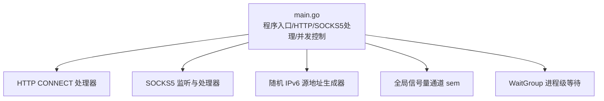
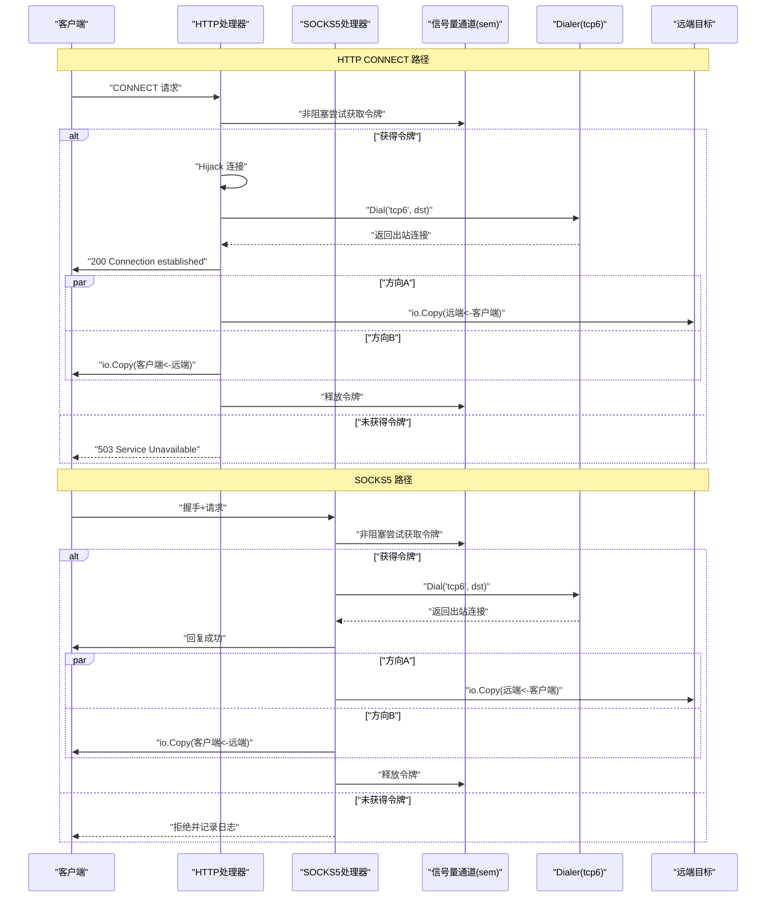
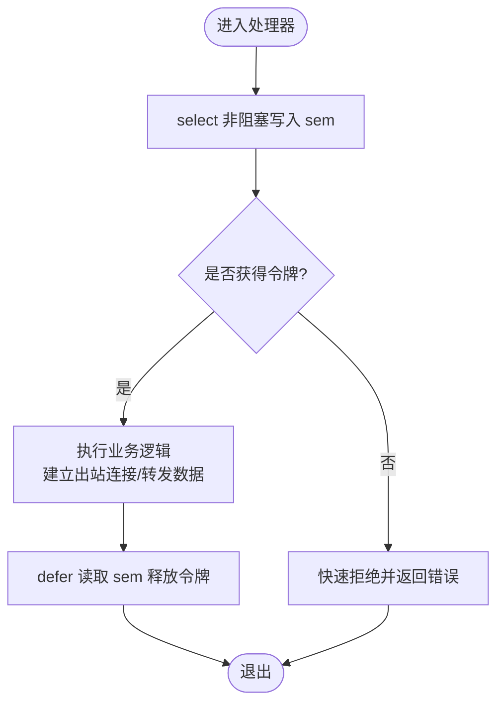
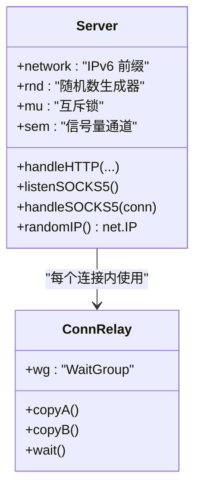
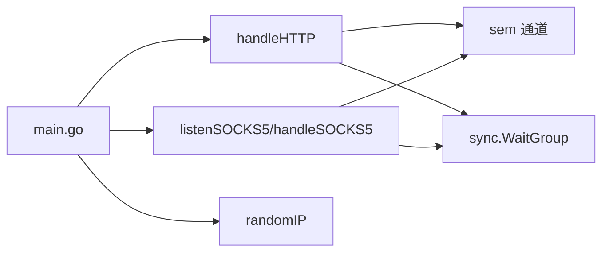

# 并发控制机制

<cite>
**本文引用的文件**   
- [main.go](file://main.go)
- [REDME.md](file://REDME.md)
</cite>

## 目录
1. [简介](#简介)
2. [项目结构](#项目结构)
3. [核心组件](#核心组件)
4. [架构总览](#架构总览)
5. [详细组件分析](#详细组件分析)
6. [依赖关系分析](#依赖关系分析)
7. [性能与调优](#性能与调优)
8. [故障排查指南](#故障排查指南)
9. [结论](#结论)

## 简介
本技术文档聚焦于该项目的并发控制机制，围绕“基于 channel 的信号量限流模型”展开，系统阐述以下主题：
- 信号量（semaphore）的设计原理与实现方式
- 并发连接限制的配置机制
- sem 通道的初始化、获取与释放模式（阻塞与非阻塞）
- goroutine 生命周期管理（WaitGroup、协程同步、优雅关闭）
- 资源泄漏防护（defer、连接及时释放、内存占用控制）
- 并发性能调优建议（信号量大小、超时设置、监控指标）
- 并发问题诊断方法与调试技巧

## 项目结构
仓库为单文件应用，入口与全部业务逻辑集中在 main.go；README 提供运行说明与特性概述。

图示来源
- [main.go:1-76](file://main.go#L1-L76)

章节来源
- [main.go:1-76](file://main.go#L1-L76)
- [REDME.md:1-25](file://REDME.md#L1-L25)

## 核心组件
- server 结构体：持有网络前缀、随机数生成器、互斥锁以及并发信号量通道。
- HTTP CONNECT 处理器：解析请求、劫持连接、建立出站 tcp6 连接、双向转发。
- SOCKS5 监听与处理器：完成握手、解析请求、建立出站 tcp6 连接、双向转发。
- 随机 IPv6 源地址生成器：在给定 CIDR 前缀范围内生成随机 IP。
- 全局信号量通道 sem：用于限制最大并发连接数。
- WaitGroup：用于主进程等待服务协程退出。

章节来源
- [main.go:24-43](file://main.go#L24-L43)
- [main.go:78-104](file://main.go#L78-L104)
- [main.go:108-197](file://main.go#L108-L197)
- [main.go:201-274](file://main.go#L201-L274)

## 架构总览
下图展示了从客户端到出站连接的完整流程，包括并发控制点、资源清理点与数据流向。

图示来源
- [main.go:108-197](file://main.go#L108-L197)
- [main.go:201-274](file://main.go#L201-L274)

## 详细组件分析

### 信号量限流模型（channel-based semaphore）
- 设计要点
  - 使用带缓冲的 channel 作为令牌桶，容量即最大并发数。
  - 通过 select + default 实现“非阻塞”获取：若无法立即获得令牌则快速失败，避免堆积。
  - 使用 defer 确保在任何退出路径上都能释放令牌，防止泄漏。
- 关键位置
  - 初始化：在启动时根据命令行参数创建带缓冲的 sem 通道。
  - 获取：在 HTTP 和 SOCKS5 处理入口处进行非阻塞获取。
  - 释放：在函数入口处以 defer 形式释放。

图示来源
- [main.go:126-133](file://main.go#L126-L133)
- [main.go:221-227](file://main.go#L221-L227)
- [main.go:39-43](file://main.go#L39-L43)

章节来源
- [main.go:39-43](file://main.go#L39-L43)
- [main.go:126-133](file://main.go#L126-L133)
- [main.go:221-227](file://main.go#L221-L227)

### 并发连接限制配置机制
- 通过命令行参数 -c 指定最大并发连接数，对应 sem 通道容量。
- 默认值与示例见 README 中的运行命令片段。

章节来源
- [main.go:17-22](file://main.go#L17-L22)
- [REDME.md:80-92](file://REDME.md#L80-L92)

### sem 通道的初始化与使用模式
- 初始化
  - 在 main 中根据 limit 参数创建带缓冲的 chan struct{}。
- 获取模式
  - 采用 select + default 的非阻塞模式，避免请求堆积导致雪崩。
- 释放策略
  - 使用 defer 保证无论正常或异常路径均能释放令牌。

章节来源
- [main.go:39-43](file://main.go#L39-L43)
- [main.go:126-133](file://main.go#L126-L133)
- [main.go:221-227](file://main.go#L221-L227)

### goroutine 生命周期管理与优雅关闭
- 进程级等待
  - 使用 sync.WaitGroup 等待 HTTP 与 SOCKS5 服务协程退出。
- 连接级同步
  - 在每个连接处理中使用局部 WaitGroup 等待两个 io.Copy 协程结束，确保两端连接完全关闭后再退出。
- 优雅关闭现状
  - 当前实现未显式调用 Server.Shutdown()，而是依赖 ListenAndServe 的错误返回退出。建议在外部进程管理器（systemd 等）中发送终止信号触发优雅关闭。

图示来源
- [main.go:24-29](file://main.go#L24-L29)
- [main.go:184-196](file://main.go#L184-L196)
- [main.go:261-273](file://main.go#L261-L273)

章节来源
- [main.go:45-76](file://main.go#L45-L76)
- [main.go:184-196](file://main.go#L184-L196)
- [main.go:261-273](file://main.go#L261-L273)

### 资源泄漏防护措施
- defer 的正确使用
  - 连接 Close：客户端连接、出站连接、监听套接字均在合适位置使用 defer 关闭。
  - 信号量释放：在获取成功后以 defer 释放令牌。
- 连接资源的及时释放
  - 在错误分支也确保已建立的连接被正确关闭。
- 内存占用的有效控制
  - 使用 io.Copy 进行零拷贝式转发，减少额外分配。
  - 对 Hijack 后的缓冲残留数据进行丢弃，避免内存滞留。

章节来源
- [main.go:146-170](file://main.go#L146-L170)
- [main.go:218-253](file://main.go#L218-L253)
- [main.go:149-151](file://main.go#L149-L151)

### 协议处理与数据转发
- HTTP CONNECT
  - 校验方法、解析目标地址、Hijack 连接、建立出站 tcp6 连接、发送 200、双向转发。
- SOCKS5
  - 握手、解析请求（支持域名与 IPv6）、建立出站 tcp6 连接、回复成功、双向转发。

章节来源
- [main.go:108-197](file://main.go#L108-L197)
- [main.go:201-274](file://main.go#L201-L274)

## 依赖关系分析
- 内部依赖
  - server 结构体聚合了网络前缀、随机数生成器、互斥锁与信号量通道。
  - HTTP 与 SOCKS5 处理器共享同一 sem 通道，实现全局并发上限。
- 外部依赖
  - 标准库 net/http、net、sync、time 等。
- 耦合与内聚
  - 高内聚：每个处理器负责单一协议的完整生命周期。
  - 低耦合：通过 sem 通道解耦并发控制与具体协议处理。

图示来源
- [main.go:24-43](file://main.go#L24-L43)
- [main.go:108-197](file://main.go#L108-L197)
- [main.go:201-274](file://main.go#L201-L274)

章节来源
- [main.go:24-43](file://main.go#L24-L43)
- [main.go:108-197](file://main.go#L108-L197)
- [main.go:201-274](file://main.go#L201-L274)

## 性能与调优
- 信号量大小配置
  - 依据服务器 CPU 核数、内存、出站带宽与目标侧能力综合评估。
  - 过大可能导致内核态资源耗尽（fd、conntrack），过小会限制吞吐。
- 超时设置优化
  - 出站 Dialer 超时已在代码中设置，可根据网络质量调整，避免长尾连接占用并发槽位。
- 监控指标收集
  - 建议统计：活跃连接数、拒绝计数（too many connections）、出站拨号失败率、平均延迟与吞吐。
  - 可通过结构化日志输出关键事件，结合外部监控系统采集。
- 其他优化建议
  - 合理设置 TCP NoDelay，降低小包延迟（代码中已启用）。
  - 在高并发场景下可考虑将随机 IP 生成改为无锁方案（如 per-goroutine 随机源），减少互斥锁竞争。

[本节为通用指导，不直接分析具体文件]

## 故障排查指南
- 常见问题定位
  - “too many connections”：表明 sem 已满，需增大 -c 或优化下游处理能力。
  - 拨号失败：检查 DNS、路由、防火墙与目标可达性。
  - 连接未释放：确认所有路径均执行了 Close 与 sem 释放。
- 调试技巧
  - 开启详细日志，关注 [HTTP]/[SOCKS5] 相关日志关键字。
  - 使用 pprof 观察 goroutine 数量与阻塞热点。
  - 使用 ss/netstat 观察本地与远端连接状态。
- 优雅关闭
  - 当前实现未内置 Shutdown 流程，建议使用 systemd 等进程管理器发送 SIGTERM，并在未来版本增加优雅关闭逻辑。

章节来源
- [main.go:126-133](file://main.go#L126-L133)
- [main.go:221-227](file://main.go#L221-L227)
- [main.go:164-170](file://main.go#L164-L170)
- [main.go:247-253](file://main.go#L247-L253)

## 结论
本项目采用简洁高效的 channel-based 信号量模型实现全局并发限流，配合 defer 与 WaitGroup 保障资源安全与协程同步。通过合理的 -c 配置与超时设置，可在多核环境下稳定承载较高并发。后续可在优雅关闭、指标采集与无锁随机 IP 生成等方面进一步增强，以提升可观测性与可扩展性。