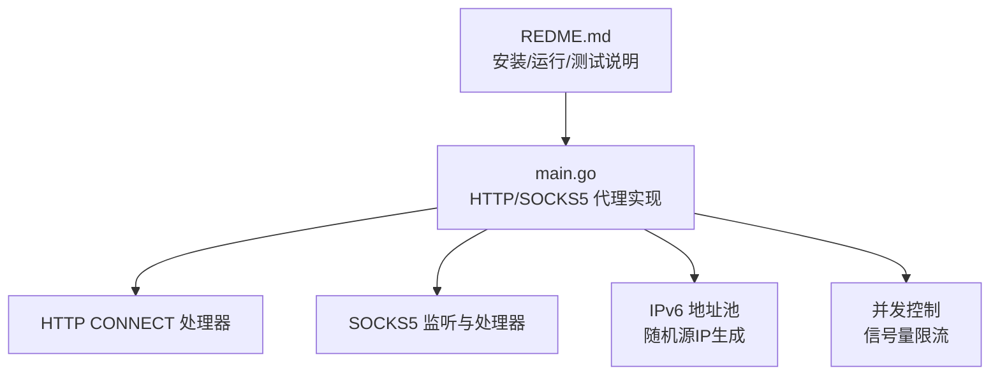
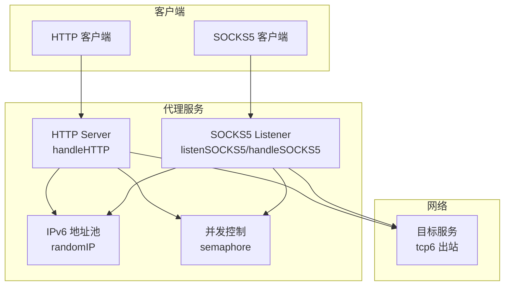
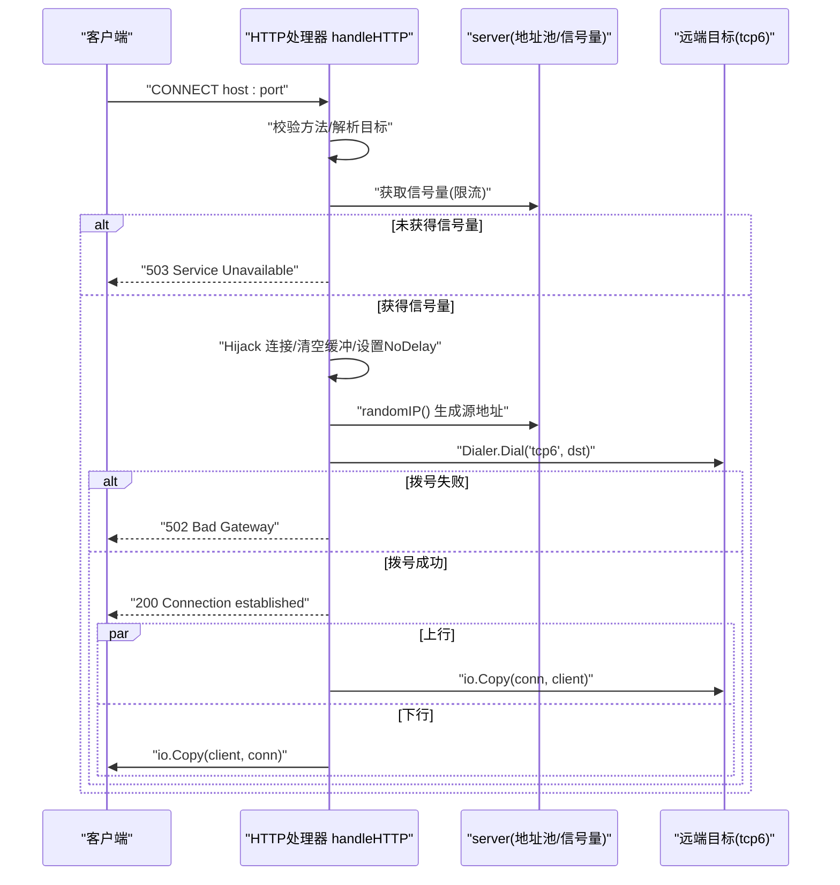
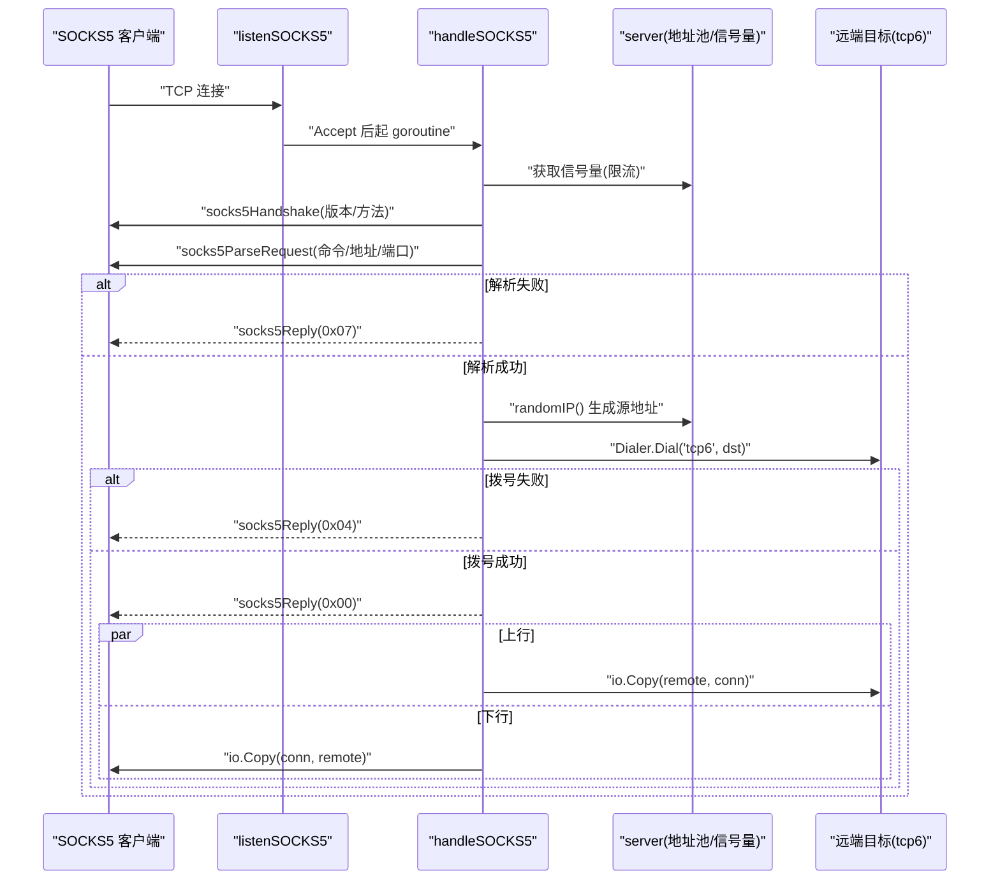
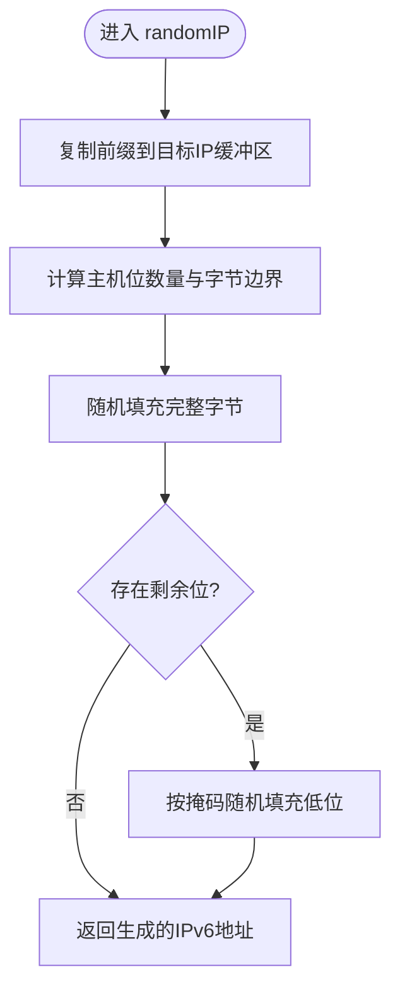
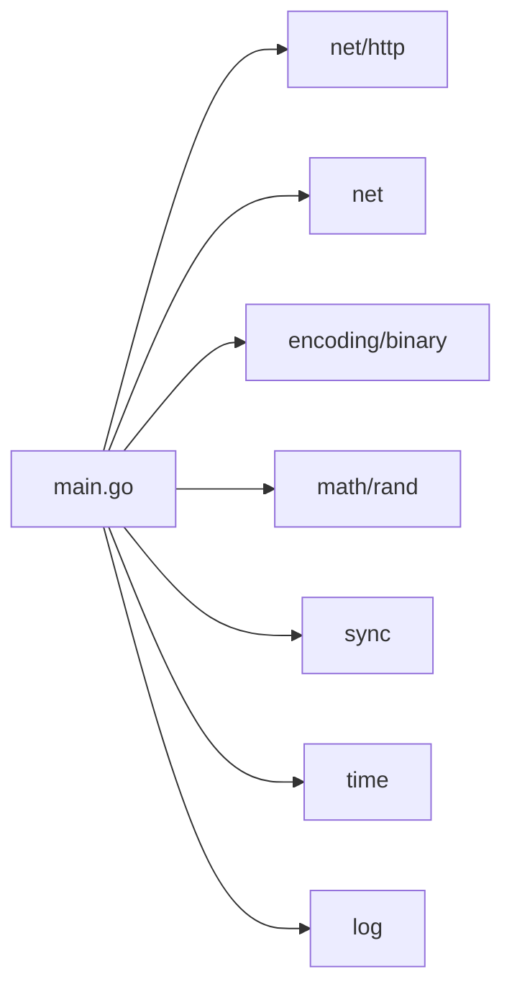

# 核心功能

<cite>
**本文引用的文件**   
- [main.go](file://main.go)
- [REDME.md](file://REDME.md)
</cite>

## 目录
1. [简介](#简介)
2. [项目结构](#项目结构)
3. [核心组件](#核心组件)
4. [架构总览](#架构总览)
5. [详细组件分析](#详细组件分析)
6. [依赖关系分析](#依赖关系分析)
7. [性能考量与调优](#性能考量与调优)
8. [故障排查指南](#故障排查指南)
9. [结论](#结论)
10. [附录：配置项与用法](#附录配置项与用法)

## 简介
本项目是一个基于 IPv6 前缀的轻量级代理池，提供 HTTP CONNECT 与 SOCKS5 两种代理协议。其核心目标是：
- 强制使用 IPv6 出口（通过 tcp6 拨号）
- 在给定 IPv6 前缀范围内随机生成源地址，实现“多出口”效果
- 提供并发限流、连接劫持、数据转发等基础能力
- 支持 /112 子网隔离，便于在同一 /64 下部署多台实例互不干扰

该文档聚焦于以下技术要点：
- HTTP CONNECT 代理的实现原理与请求处理流程
- SOCKS5 协议的握手、请求解析与响应机制
- IPv6 地址池管理算法（随机地址生成、子网隔离、并发安全）
- 并发控制模型（信号量限流、goroutine 管理、资源清理）
- 配置选项、性能调优建议与常见问题排查

## 项目结构
仓库采用极简单文件主程序结构，所有核心逻辑集中在 main.go；README 提供快速开始与系统配置说明。



图表来源
- [main.go:1-347](file://main.go#L1-L347)
- [REDME.md:1-98](file://REDME.md#L1-L98)

章节来源
- [main.go:1-76](file://main.go#L1-L76)
- [REDME.md:1-25](file://REDME.md#L1-L25)

## 核心组件
- 服务器结构体 server：持有 IPv6 网络前缀、随机数生成器、互斥锁与信号量通道，用于并发控制与地址分配。
- HTTP CONNECT 处理器：仅接受 CONNECT 方法，劫持底层 TCP 连接，选择随机 IPv6 源地址，建立到目标的双向转发。
- SOCKS5 处理器：实现版本协商、认证（无认证）、CONNECT 命令解析、错误码回复与双向转发。
- IPv6 地址池：根据前缀掩码长度计算主机位，按字节粒度随机填充，保证生成的地址落在指定前缀内。
- 并发控制：全局信号量限制最大并发连接数，防止资源耗尽。

章节来源
- [main.go:24-43](file://main.go#L24-L43)
- [main.go:78-104](file://main.go#L78-L104)
- [main.go:108-197](file://main.go#L108-L197)
- [main.go:201-274](file://main.go#L201-L274)
- [main.go:276-346](file://main.go#L276-L346)

## 架构总览
整体架构围绕一个进程内的两个监听端口展开：HTTP CONNECT 与 SOCKS5。两者共享同一地址池与并发控制策略。



图表来源
- [main.go:31-76](file://main.go#L31-L76)
- [main.go:108-197](file://main.go#L108-L197)
- [main.go:201-274](file://main.go#L201-L274)
- [main.go:78-104](file://main.go#L78-L104)

## 详细组件分析

### HTTP CONNECT 代理
- 入口与路由：自定义 http.HandlerFunc 作为 Handler，绕过默认路由限制，直接处理 CONNECT 请求。
- 目标解析：优先使用 r.Host，若缺失则回退到 r.URL.Host，并补全默认端口。
- 并发控制：进入处理前先尝试获取信号量，失败则返回 503。
- 连接劫持：通过 http.Hijacker 接管底层 TCP 连接，清空缓冲，设置 TCP_NODELAY。
- 源地址选择：从 IPv6 地址池随机选取源 IP，使用 net.Dialer 以 tcp6 拨号至目标。
- 成功/失败路径：拨号成功发送 200 并启动双向 io.Copy；失败返回 502。
- 资源清理：defer 关闭连接，确保 goroutine 退出后释放资源。



图表来源
- [main.go:108-197](file://main.go#L108-L197)
- [main.go:78-104](file://main.go#L78-L104)

章节来源
- [main.go:108-197](file://main.go#L108-L197)

### SOCKS5 代理
- 监听与分发：net.Listen("tcp") 监听端口，每连接起一个 goroutine 处理。
- 握手阶段：读取版本号与方法列表，仅支持无认证（0x00），返回协商结果。
- 请求解析：读取命令字段，仅支持 CONNECT（0x01）；支持域名与 IPv6 地址类型，拒绝 IPv4。
- 拨号与转发：使用 tcp6 拨号目标，成功后发送 0x00 成功响应，随后双向转发。
- 错误处理：对握手/解析/拨号失败分别返回对应错误码（如 0x04、0x07）。



图表来源
- [main.go:201-274](file://main.go#L201-L274)
- [main.go:276-346](file://main.go#L276-L346)
- [main.go:78-104](file://main.go#L78-L104)

章节来源
- [main.go:201-274](file://main.go#L201-L274)
- [main.go:276-346](file://main.go#L276-L346)

### IPv6 地址池管理算法
- 输入：CIDR 前缀（例如 /112），由命令行参数传入并在启动时解析为 *net.IPNet。
- 主机位计算：根据掩码长度计算主机位数量，确定需要随机化的字节范围与剩余位数。
- 随机填充：
  - 完整字节部分：逐字节随机填充 0..255。
  - 不足一字节的部分：按剩余位数 mask 低位随机，保留高位不变。
- 并发安全：使用互斥锁保护随机 IP 生成过程，避免竞争条件。
- 子网隔离：不同实例使用不同前缀（如 /112），即使同属一个 /64，也不会产生冲突。



图表来源
- [main.go:78-104](file://main.go#L78-L104)

章节来源
- [main.go:78-104](file://main.go#L78-L104)

### 并发控制模型
- 信号量限流：使用带缓冲的 channel 作为信号量，容量由 -c 参数决定。进入处理逻辑前尝试非阻塞获取，失败即拒绝新连接。
- goroutine 管理：
  - HTTP：每个连接在 hijack 后启动两个 goroutine 进行双向拷贝，使用 WaitGroup 等待结束。
  - SOCKS5：每个连接独立 goroutine 处理握手、解析、拨号与转发，同样使用 WaitGroup 管理双向拷贝。
- 资源清理：
  - defer 关闭客户端与远端连接，确保异常路径也能释放资源。
  - 信号量在函数退出时归还，避免泄漏。

```mermaid
classDiagram
class Server {
+network : *net.IPNet
+rnd : *rand.Rand
+mu : sync.Mutex
+sem : chan struct{}
+randomIP() net.IP
+handleHTTP(http.ResponseWriter, *http.Request)
+listenSOCKS5() error
+handleSOCKS5(net.Conn)
+socks5Handshake(net.Conn) error
+socks5ParseRequest(net.Conn) (string, error)
+socks5Reply(net.Conn, byte) error
}
```

图表来源
- [main.go:24-43](file://main.go#L24-L43)
- [main.go:78-104](file://main.go#L78-L104)
- [main.go:108-197](file://main.go#L108-L197)
- [main.go:201-274](file://main.go#L201-L274)
- [main.go:276-346](file://main.go#L276-L346)

章节来源
- [main.go:24-43](file://main.go#L24-L43)
- [main.go:108-197](file://main.go#L108-L197)
- [main.go:201-274](file://main.go#L201-L274)

## 依赖关系分析
- 标准库依赖：
  - net/http：HTTP 服务器与 Hijacker 接口
  - net：TCP 监听、拨号、地址解析
  - encoding/binary：大端序端口解析
  - math/rand：随机数生成
  - sync：互斥锁、WaitGroup
  - time：超时控制
  - log：日志输出
- 外部依赖：零外部依赖，纯 Go 标准库实现。



图表来源
- [main.go:1-15](file://main.go#L1-L15)

章节来源
- [main.go:1-15](file://main.go#L1-L15)

## 性能考量与调优
- 并发上限 -c：
  - 建议根据系统内核参数、内存与 CPU 核数评估合理值。高并发场景可结合 v2ray/xray 的 smux 复用缓解 conntrack 压力。
- 超时与延迟：
  - Dialer 超时设置为 30 秒，可根据网络质量调整。
  - 已启用 TCP_NODELAY，减少小包延迟。
- 地址空间：
  - 使用 /112 前缀可获得 2^16=65536 个可用地址，适合中等规模并发；/64 可提供更大空间但需配合 ndppd 与本地路由。
- 系统内核参数（参考 README）：
  - 开启 net.ipv6.ip_nonlocal_bind、转发与邻居表阈值，优化 IPv6 转发与 ARP 行为。
  - 调整 tcp_tw_reuse、端口范围与 fin_timeout，提升连接复用与回收效率。

[本节为通用指导，无需源码引用]

## 故障排查指南
- 无法绑定或启动失败：
  - 检查 -http/-socks 端口是否被占用，确认权限与防火墙规则。
- 连接被拒绝或 503：
  - 可能达到并发上限 -c，适当增大或优化上游处理能力。
- 拨号失败 502/0x04：
  - 目标不可达或 DNS 解析问题；确认目标可达性与 IPv6 连通性。
- 地址冲突或异常：
  - 确认各实例使用不同前缀（如 /112），避免地址重叠。
- 性能瓶颈：
  - 观察系统指标（CPU、内存、连接数、丢包），结合内核参数与 -c 调优。
- 日志定位：
  - 关注 [HTTP]/[SOCKS5] 前缀日志，区分握手、解析、拨号与转发阶段的错误信息。

章节来源
- [main.go:108-197](file://main.go#L108-L197)
- [main.go:201-274](file://main.go#L201-L274)
- [REDME.md:26-98](file://REDME.md#L26-L98)

## 结论
本实现以最小依赖提供了稳定的 IPv6 代理池能力，涵盖 HTTP CONNECT 与 SOCKS5 双协议，具备地址池随机化、子网隔离与并发限流等关键特性。通过合理的系统参数与 -c 调优，可在生产环境中稳定承载较高并发流量。

[本节为总结性内容，无需源码引用]

## 附录：配置项与用法
- 命令行参数
  - -http：HTTP CONNECT 监听地址，默认 0.0.0.0:53420
  - -socks：SOCKS5 监听地址，默认 0.0.0.0:53421
  - -prefix：IPv6 前缀，如 240e:6b0:50::/112
  - -c：最大并发连接数（信号量容量），默认 5000
- 快速运行示例（参见 README）
  - 安装脚本与手动编译步骤
  - 系统内核参数与 ndppd 配置
  - curl 测试命令

章节来源
- [main.go:17-22](file://main.go#L17-L22)
- [REDME.md:13-25](file://REDME.md#L13-L25)
- [REDME.md:79-98](file://REDME.md#L79-L98)