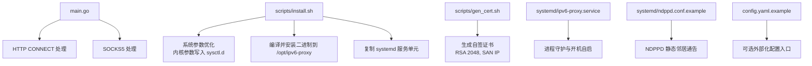
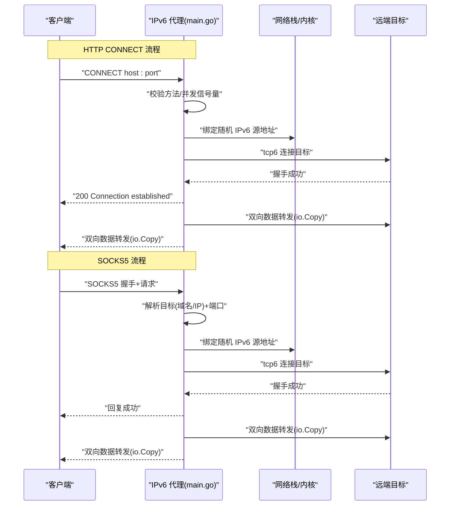
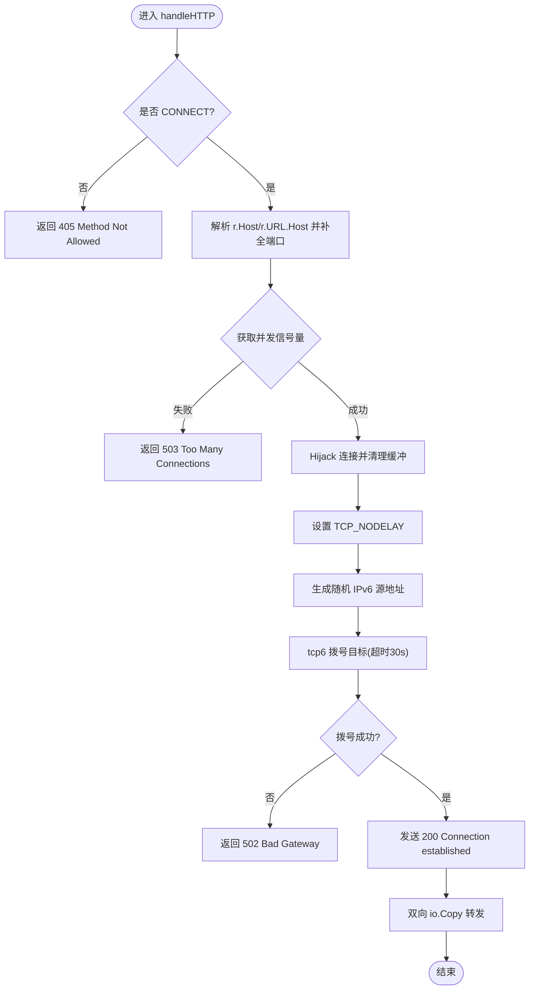
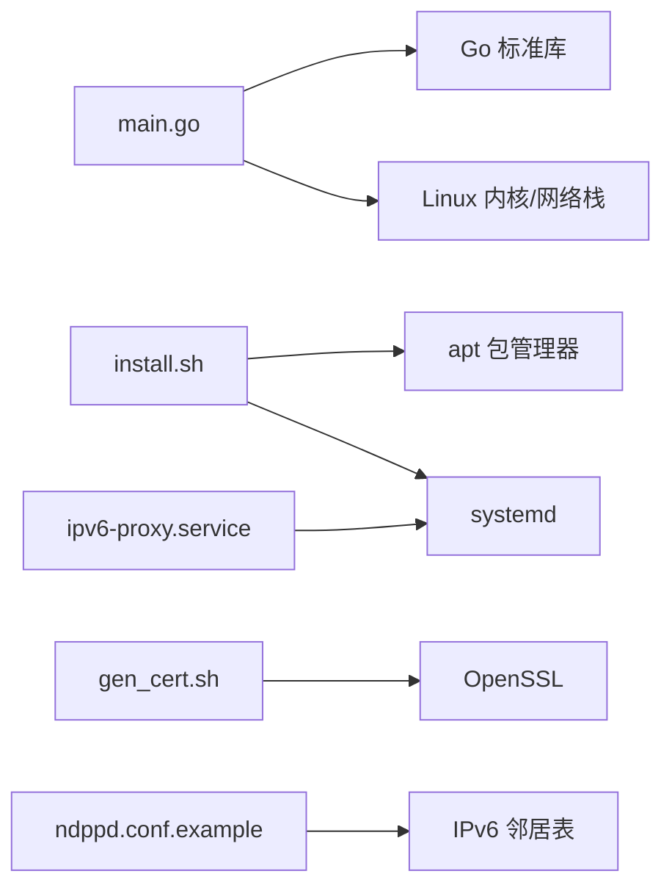

# 部署运维

<cite>
**本文引用的文件列表**
- [main.go](file://main.go)
- [install.sh](file://scripts/install.sh)
- [gen_cert.sh](file://scripts/gen_cert.sh)
- [REDME.md](file://REDME.md)
- [ipv6-proxy.service](file://systemd/ipv6-proxy.service)
- [ndppd.conf.example](file://systemd/ndppd.conf.example)
- [config.yaml.example](file://config.yaml.example)
- [go.mod](file://go.mod)
</cite>

## 目录
1. [简介](#简介)
2. [项目结构](#项目结构)
3. [核心组件](#核心组件)
4. [架构总览](#架构总览)
5. [详细组件分析](#详细组件分析)
6. [依赖关系分析](#依赖关系分析)
7. [性能与容量规划](#性能与容量规划)
8. [故障排查指南](#故障排查指南)
9. [结论](#结论)
10. [附录：常用命令与最佳实践](#附录常用命令与最佳实践)

## 简介
本指南面向生产环境，提供 IPv6 代理池在不同环境（物理服务器、虚拟机、容器）下的部署方案，覆盖自动化脚本使用、systemd 服务管理、日志与监控告警、安全加固、性能调优与故障恢复等。项目为纯 Go 实现，支持 HTTP CONNECT 与 SOCKS5 双协议，强制通过 IPv6 出口，内置并发限流，适用于与 v2ray/xray 配合的场景。

## 项目结构
仓库包含可执行程序源码、一键安装脚本、证书生成脚本、示例配置与服务单元文件等。整体组织清晰，便于在多种环境中快速落地。

图表来源
- [main.go:31-76](file://main.go#L31-L76)
- [install.sh:73-91](file://scripts/install.sh#L73-L91)
- [gen_cert.sh:20-30](file://scripts/gen_cert.sh#L20-L30)
- [ipv6-proxy.service](file://systemd/ipv6-proxy.service)
- [ndppd.conf.example](file://systemd/ndppd.conf.example)
- [config.yaml.example](file://config.yaml.example)

章节来源
- [main.go:1-347](file://main.go#L1-L347)
- [install.sh:1-101](file://scripts/install.sh#L1-L101)
- [gen_cert.sh:1-38](file://scripts/gen_cert.sh#L1-L38)
- [REDME.md:1-98](file://REDME.md#L1-L98)

## 核心组件
- 主程序 main.go
  - 启动 HTTP CONNECT 与 SOCKS5 监听端口，解析命令行参数，初始化 IPv6 前缀与并发信号量。
  - 随机源地址生成器基于给定前缀分配主机位，保证同一 /64 下多实例互不冲突。
  - 双向数据转发采用 io.Copy，连接建立后无状态中继。
- 安装脚本 install.sh
  - 自动安装依赖、下载源码或压缩包、编译、设置内核参数、安装 systemd 服务单元。
- 证书生成脚本 gen_cert.sh
  - 生成 RSA 2048 自签证书，支持 SAN IP，输出到指定目录，权限最小化。
- systemd 服务单元 ipv6-proxy.service
  - 定义服务运行用户、工作目录、重启策略、日志采集等。
- NDPPD 示例配置 ndppd.conf.example
  - 用于将本地 IPv6 前缀静态通告到上游路由器，使对端能正确路由到本机。
- 示例配置 config.yaml.example
  - 作为未来扩展的外部化配置模板（当前版本以命令行参数为主）。

章节来源
- [main.go:17-76](file://main.go#L17-L76)
- [main.go:78-104](file://main.go#L78-L104)
- [main.go:106-197](file://main.go#L106-L197)
- [main.go:199-347](file://main.go#L199-L347)
- [install.sh:36-91](file://scripts/install.sh#L36-L91)
- [gen_cert.sh:10-38](file://scripts/gen_cert.sh#L10-L38)
- [ipv6-proxy.service](file://systemd/ipv6-proxy.service)
- [ndppd.conf.example](file://systemd/ndppd.conf.example)
- [config.yaml.example](file://config.yaml.example)

## 架构总览
下图展示了客户端通过 HTTP CONNECT 或 SOCKS5 访问后端目标时，IPv6 代理池的调用链路与关键控制点。

图表来源
- [main.go:106-197](file://main.go#L106-L197)
- [main.go:199-347](file://main.go#L199-L347)

## 详细组件分析

### 主程序 main.go
- 启动与参数
  - 监听 HTTP CONNECT 与 SOCKS5 端口，默认分别位于 53420 与 53421；可通过 -http/-socks 调整。
  - -prefix 指定 IPv6 前缀（如 /112），用于随机源地址分配。
  - -c 限制最大并发连接数，防止资源耗尽。
- 随机源地址生成
  - 根据前缀掩码计算主机位长度，按字节填充随机值，确保在同一 /64 下不同实例互不冲突。
- HTTP CONNECT 处理
  - 仅允许 CONNECT 方法；若未携带端口则补全默认 443。
  - 使用 Hijack 接管连接，清空残留缓冲，设置 TCP_NODELAY。
  - 通过 net.Dialer 指定 LocalAddr 为随机 IPv6 源地址，超时 30s。
  - 成功后返回 200，随后双向拷贝数据。
- SOCKS5 处理
  - 握手阶段仅接受无认证模式。
  - 解析请求，支持域名与 IPv6 地址类型，拒绝 IPv4。
  - 同样通过随机 IPv6 源地址拨号，成功后返回 0x00 并转发数据。
- 并发控制
  - 使用带缓冲 channel 作为信号量，超出限制直接拒绝，避免内存与文件描述符耗尽。

图表来源
- [main.go:106-197](file://main.go#L106-L197)

章节来源
- [main.go:17-76](file://main.go#L17-L76)
- [main.go:78-104](file://main.go#L78-L104)
- [main.go:106-197](file://main.go#L106-L197)
- [main.go:199-347](file://main.go#L199-L347)

### 安装脚本 install.sh
- 功能概览
  - 检查 root 权限，安装 golang-go、git、ndppd、curl 等依赖。
  - 创建安装目录 /opt/ipv6-proxy 与配置目录 /etc/ipv6-proxy。
  - 从 GitHub 克隆或下载源码，执行 go mod tidy 与 go build 生成二进制。
  - 写入内核参数至 /etc/sysctl.d/99-ipv6-proxy.conf 并立即生效。
  - 复制 systemd 服务单元到 /etc/systemd/system/ipv6-proxy.service，重载 daemon。
- 注意事项
  - 需要公网 IPv6 前缀并已在本机添加 local 路由。
  - 需配置 ndppd 将前缀静态通告给上游路由器。
  - 建议在生产环境固定 Go 版本与构建产物校验。

章节来源
- [install.sh:1-101](file://scripts/install.sh#L1-L101)

### 证书生成脚本 gen_cert.sh
- 功能概览
  - 生成 RSA 2048 自签证书，CN 默认取本机外网 IPv4（可通过 ifconfig.me 获取），也可传入自定义 CN。
  - 输出 cert.pem 与 key.pem 到 /usr/local/etc/xray，key.pem 权限设为 600。
  - 提供验证命令输出 Subject 与 SAN 信息。
- 适用场景
  - 与 v2ray/xray 搭配使用时，作为 TLS 证书的快速生成工具。
- 安全建议
  - 生产环境建议使用受信任 CA 签发的证书；自签证书仅用于测试或内网隔离场景。

章节来源
- [gen_cert.sh:1-38](file://scripts/gen_cert.sh#L1-L38)

### systemd 服务管理
- 服务单元 ipv6-proxy.service
  - 由 install.sh 复制到 /etc/systemd/system/ipv6-proxy.service。
  - 典型职责包括：指定 ExecStart、Restart=always、WorkingDirectory、User/Group、StandardOutput/StandardError 等。
- 常用操作
  - 启用与启动：systemctl enable --now ipv6-proxy
  - 停止与禁用：systemctl stop/disable ipv6-proxy
  - 查看状态：systemctl status ipv6-proxy
  - 查看日志：journalctl -u ipv6-proxy -f
- 排障要点
  - 确认端口未被占用、IPv6 前缀已正确配置、内核参数已加载。
  - 关注日志中的 “too many connections”、“hijack error”、“dial tcp6 ...” 等关键字。

章节来源
- [install.sh:87-91](file://scripts/install.sh#L87-L91)
- [ipv6-proxy.service](file://systemd/ipv6-proxy.service)

### NDPPD 配置
- 作用
  - 将本地 IPv6 前缀静态通告到上游路由器，使得对端设备可将该前缀路由到本机。
- 配置步骤
  - 参考示例配置文件，将规则中的接口与前缀替换为本机实际值。
  - 启用并重启 ndppd 服务。
- 验证
  - 使用 ip -6 route 查看是否存在指向本地的前缀路由。
  - 使用 ping6 或 curl 测试可达性。

章节来源
- [ndppd.conf.example](file://systemd/ndppd.conf.example)
- [REDME.md:59-77](file://REDME.md#L59-L77)

### 外部化配置
- 示例文件 config.yaml.example
  - 当前版本以命令行参数为主，示例文件可作为后续扩展的模板。
  - 建议在容器或编排平台中通过环境变量注入参数，保持镜像不可变。

章节来源
- [config.yaml.example](file://config.yaml.example)

## 依赖关系分析
- 运行时依赖
  - Go 标准库：net/http、net、crypto/rand、encoding/binary、sync、time、log、flag、io、errors、fmt、math/rand。
  - 操作系统能力：IPv6 路由、TCP 套接字、systemd 服务管理。
- 构建期依赖
  - Go 工具链与模块管理（go mod tidy/build）。
- 外部集成
  - ndppd：邻居发现代理，用于静态前缀通告。
  - v2ray/xray：可选，结合 smux 聚合缓解 conntrack 压力。

图表来源
- [main.go:1-15](file://main.go#L1-L15)
- [install.sh:36-91](file://scripts/install.sh#L36-L91)
- [gen_cert.sh:20-30](file://scripts/gen_cert.sh#L20-L30)
- [ipv6-proxy.service](file://systemd/ipv6-proxy.service)
- [ndppd.conf.example](file://systemd/ndppd.conf.example)

章节来源
- [main.go:1-15](file://main.go#L1-L15)
- [install.sh:36-91](file://scripts/install.sh#L36-L91)
- [gen_cert.sh:20-30](file://scripts/gen_cert.sh#L20-L30)
- [ipv6-proxy.service](file://systemd/ipv6-proxy.service)
- [ndppd.conf.example](file://systemd/ndppd.conf.example)

## 性能与容量规划
- 并发与限流
  - 通过 -c 控制最大并发连接数，建议根据 CPU 核数、内存与目标带宽评估。
  - 观察日志中 “too many connections” 频率，适当提高 -c 或扩容实例。
- 内核参数
  - 启用 net.ipv6.ip_nonlocal_bind、net.ipv6.conf.all.forwarding。
  - 调整 IPv6 邻居表阈值 gc_thresh1/2/3，避免在高并发下丢包。
  - 开启 net.ipv4.tcp_tw_reuse，缩短 tcp_fin_timeout，扩大 ip_local_port_range。
- 连接复用
  - 与 v2ray/xray 配合使用 smux，减少短连接数量，降低 conntrack 压力。
- 资源监控
  - 监控指标：CPU、内存、FD 使用数、连接数、错误率、延迟分位数。
  - 推荐接入 Prometheus + Grafana，暴露进程级指标或通过 sidecar 采集。

[本节为通用指导，无需特定文件引用]

## 故障排查指南
- 无法绑定端口
  - 现象：启动时报端口占用或权限不足。
  - 排查：确认端口未被占用、非特权端口无需 root；必要时使用 iptables/nftables 放行。
- IPv6 前缀不可达
  - 现象：拨号失败或目标不可达。
  - 排查：检查本机 local 路由是否正确、ndppd 是否运行且规则匹配、上游路由器是否学习到前缀。
- 并发受限频繁拒绝
  - 现象：大量 “too many connections”。
  - 排查：提升 -c 或横向扩容实例；检查下游目标响应时间与错误率。
- 日志定位
  - 使用 journalctl -u ipv6-proxy -f 实时查看；关注 “[HTTP-FAIL]”、“[SOCKS5-FAIL]” 等关键字。
- 证书问题
  - 现象：TLS 握手失败或 SAN 不匹配。
  - 排查：使用 gen_cert.sh 重新生成，确认 CN/SAN 与实际域名或 IP 一致；生产环境改用受信任 CA。

章节来源
- [main.go:126-133](file://main.go#L126-L133)
- [main.go:164-176](file://main.go#L164-L176)
- [main.go:247-259](file://main.go#L247-L259)
- [install.sh:73-85](file://scripts/install.sh#L73-L85)
- [gen_cert.sh:20-38](file://scripts/gen_cert.sh#L20-L38)

## 结论
本项目以极简架构实现了高可用的 IPv6 出口代理池，具备双协议支持与并发限流能力。通过一键安装脚本与 systemd 服务管理，可在物理机、虚拟机与容器中快速部署。生产环境应重点关注 IPv6 路由与邻居通告、内核参数调优、证书管理与监控告警，并结合 smux 等技术提升整体吞吐与稳定性。

[本节为总结性内容，无需特定文件引用]

## 附录：常用命令与最佳实践

- 快速开始
  - 一键安装：参考 README 提供的 curl 管道方式执行 install.sh。
  - 手动编译运行：参考 README 的手动部署步骤。
- 服务管理
  - systemctl enable --now ipv6-proxy
  - systemctl restart ipv6-proxy
  - journalctl -u ipv6-proxy -f
- 安全加固
  - 最小权限原则：以非 root 用户运行服务，仅开放必要端口。
  - 证书管理：生产环境使用受信任 CA；定期轮换证书与私钥。
  - 访问控制：结合防火墙与 ACL 限制来源 IP 段。
- 性能监控
  - 指标采集：进程 FD、goroutine 数、连接数、错误率、P95/P99 延迟。
  - 告警策略：错误率突增、连接数饱和、内存/CPU 异常波动。
- 故障恢复
  - 自动重启：systemd Restart=always。
  - 健康检查：对外暴露轻量健康端点（可扩展），供负载均衡探针探测。
  - 灰度发布：先小流量验证，再逐步放量。

章节来源
- [REDME.md:13-25](file://REDME.md#L13-L25)
- [REDME.md:26-98](file://REDME.md#L26-L98)
- [install.sh:92-101](file://scripts/install.sh#L92-L101)