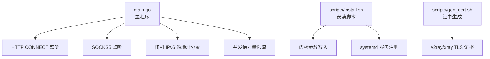
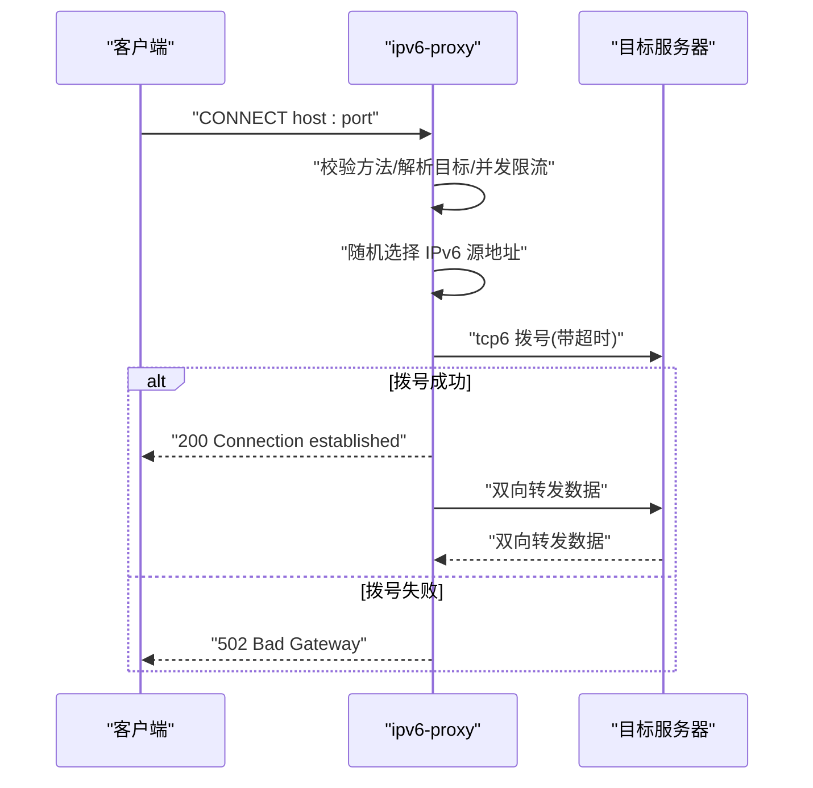
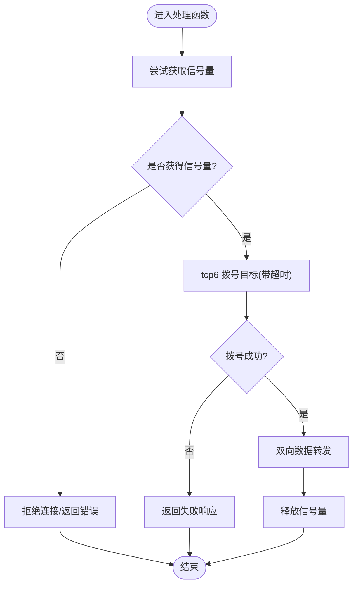
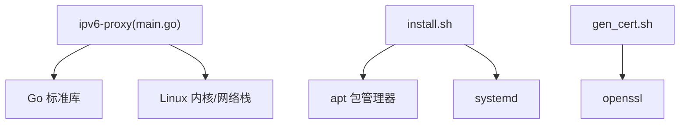

# 配置参考

<cite>
**本文引用的文件**   
- [main.go](file://main.go)
- [REDME.md](file://REDME.md)
- [install.sh](file://scripts/install.sh)
- [gen_cert.sh](file://scripts/gen_cert.sh)
</cite>

## 目录
1. [简介](#简介)
2. [项目结构](#项目结构)
3. [核心组件](#核心组件)
4. [架构总览](#架构总览)
5. [详细组件分析](#详细组件分析)
6. [依赖分析](#依赖分析)
7. [性能考虑](#性能考虑)
8. [故障排除指南](#故障排除指南)
9. [结论](#结论)
10. [附录](#附录)

## 简介
本配置参考面向 IPv6 代理池（基于 /64 或 /112 前缀的随机出口代理），提供命令行参数说明、默认值与使用示例，覆盖单机、集群与容器化部署的最佳实践；同时给出系统级配置要求（IPv6 路由、ndppd 代理、内核参数优化）以及性能调优建议与常见问题排查方法。

## 项目结构
仓库包含可执行程序源码、安装脚本、证书生成脚本及文档等。关键路径如下：
- main.go：程序入口、HTTP CONNECT 与 SOCKS5 实现、命令行参数解析、并发限流、随机源 IP 分配
- scripts/install.sh：一键安装脚本（依赖安装、编译、systemd 服务注册、内核参数写入）
- scripts/gen_cert.sh：自签证书生成（用于 v2ray/xray TLS 场景）
- REDME.md：快速开始、手动部署步骤、系统配置与测试命令

图表来源
- [main.go:1-347](file://main.go#L1-L347)
- [install.sh:1-101](file://scripts/install.sh#L1-L101)
- [gen_cert.sh:1-38](file://scripts/gen_cert.sh#L1-L38)

章节来源
- [main.go:1-347](file://main.go#L1-L347)
- [REDME.md:1-98](file://REDME.md#L1-L98)
- [install.sh:1-101](file://scripts/install.sh#L1-L101)
- [gen_cert.sh:1-38](file://scripts/gen_cert.sh#L1-L38)

## 核心组件
- HTTP CONNECT 代理：监听指定地址，仅处理 CONNECT 方法，劫持连接后以 tcp6 拨号到目标，双向转发数据。
- SOCKS5 代理：实现握手、请求解析（支持域名与 IPv6）、tcp6 拨号与双向转发。
- 随机源 IP：根据 -prefix 指定的 IPv6 前缀范围，按主机位随机填充，确保每次出站使用不同源地址。
- 并发限流：通过内置信号量限制最大并发连接数，避免资源耗尽。

章节来源
- [main.go:17-22](file://main.go#L17-L22)
- [main.go:78-104](file://main.go#L78-L104)
- [main.go:106-197](file://main.go#L106-L197)
- [main.go:199-274](file://main.go#L199-L274)

## 架构总览
整体流程为客户端通过 HTTP CONNECT 或 SOCKS5 接入，服务端进行协议处理与并发控制，随后以随机 IPv6 源地址建立 tcp6 连接至目标，完成双向数据转发。

图表来源
- [main.go:106-197](file://main.go#L106-L197)

章节来源
- [main.go:106-197](file://main.go#L106-L197)

## 详细组件分析

### 命令行参数
- -http
  - 含义：HTTP CONNECT 代理监听地址
  - 默认值：0.0.0.0:53420
  - 示例：-http 0.0.0.0:53420
- -socks
  - 含义：SOCKS5 代理监听地址
  - 默认值：0.0.0.0:53421
  - 示例：-socks 0.0.0.0:53421
- -prefix
  - 含义：出站使用的 IPv6 前缀（CIDR），用于随机源地址分配
  - 默认值：240e:6b0:50::/112
  - 示例：-prefix 240e:6b0:50::/112
- -c
  - 含义：最大并发连接数（信号量上限）
  - 默认值：5000
  - 示例：-c 10000

注意：
- 若 -http 为空字符串则不启动 HTTP 服务；-socks 同理。
- -prefix 必须为合法的 CIDR 表示，否则程序将退出并打印错误。

章节来源
- [main.go:17-22](file://main.go#L17-L22)
- [main.go:31-43](file://main.go#L31-L43)
- [main.go:48-76](file://main.go#L48-L76)

### 系统级配置要求
- 内核参数（由安装脚本写入 sysctl.d）
  - net.ipv6.ip_nonlocal_bind = 1
  - net.ipv6.conf.all.forwarding = 1
  - net.ipv6.neigh.default.gc_thresh1 = 1024
  - net.ipv6.neigh.default.gc_thresh2 = 4096
  - net.ipv6.neigh.default.gc_thresh3 = 102400
  - net.ipv4.tcp_tw_reuse = 1
  - net.ipv4.ip_local_port_range = 1024 65535
  - net.ipv4.tcp_fin_timeout = 15
- 本地路由
  - 添加 local 路由指向本机接口，例如：ip route add local <your-prefix>/64 dev <interface>
- ndppd 代理
  - 安装并配置 proxy 规则，将指定网段静态代理到路由器，使 /64 下任意地址可达

章节来源
- [install.sh:73-85](file://scripts/install.sh#L73-L85)
- [REDME.md:28-57](file://REDME.md#L28-L57)
- [REDME.md:59-77](file://REDME.md#L59-L77)

### 部署最佳实践

#### 单机部署
- 适用场景：开发测试或小规模使用
- 要点：
  - 启用 -http 和 -socks，绑定 0.0.0.0 或具体网卡 IP
  - 设置 -prefix 为可用 /64 或 /112 子网
  - 调整 -c 匹配单机资源（如 5000~10000）
  - 配置内核参数与本地路由，启动 ndppd
- 参考命令（见 README 快速开始与手动部署）

章节来源
- [REDME.md:13-25](file://REDME.md#L13-L25)
- [REDME.md:79-97](file://REDME.md#L79-L97)

#### 集群部署
- 适用场景：多节点横向扩展
- 要点：
  - 每个节点使用不同的 /64 或 /112 前缀，避免冲突
  - 在负载均衡层（如 L4/L7）对多个节点做健康检查与权重分发
  - 统一内核参数与 ndppd 配置模板，保证一致性
  - 监控指标：并发连接数、错误率、延迟分布、端口复用情况

[本节为概念性内容，无需代码引用]

#### 容器化部署
- 适用场景：Kubernetes/Docker 环境
- 要点：
  - 宿主机需具备 IPv6 能力与正确路由/NDP 配置
  - 容器网络模式建议使用 host 或桥接且开启 IPv6
  - 通过环境变量注入 -http/-socks/-prefix/-c 参数
  - 使用 init 容器执行 sysctl 与 ip route 配置（需要特权或相应 Capabilities）
  - 结合 sidecar 或 eBPF 进行流量观测与限流

[本节为概念性内容，无需代码引用]

### 并发与限流机制
- 信号量限流：-c 决定最大并发连接数，超出时返回“too many connections”
- 连接生命周期：握手成功后建立 tcp6 连接，双向 io.Copy 转发，完成后释放信号量

图表来源
- [main.go:126-133](file://main.go#L126-L133)
- [main.go:164-176](file://main.go#L164-L176)
- [main.go:221-227](file://main.go#L221-L227)
- [main.go:247-255](file://main.go#L247-L255)

章节来源
- [main.go:126-133](file://main.go#L126-L133)
- [main.go:221-227](file://main.go#L221-L227)

### 随机源地址分配
- 算法：基于 -prefix 的主机位随机填充，保留前缀部分不变
- 复杂度：O(n)，n 为主机位字节数（通常 ≤ 16）
- 安全性：同一 /64 下多台服务器可通过 /112 隔离，互不干扰

章节来源
- [main.go:78-104](file://main.go#L78-L104)

### 证书与 TLS（可选）
- gen_cert.sh 用于生成自签证书，适用于 v2ray/xray 的 TLS 配置
- 输出位置与权限由脚本管理

章节来源
- [gen_cert.sh:1-38](file://scripts/gen_cert.sh#L1-L38)

## 依赖分析
- 外部依赖
  - Go 标准库（net/http、net、crypto/rand 等）
  - 系统层：IPv6 栈、ndppd、sysctl、iproute2
- 安装脚本依赖
  - apt 包管理器（Ubuntu/Debian）
  - systemd 服务管理
  - openssl（证书生成）

图表来源
- [main.go:1-15](file://main.go#L1-L15)
- [install.sh:36-40](file://scripts/install.sh#L36-L40)
- [install.sh:87-91](file://scripts/install.sh#L87-L91)
- [gen_cert.sh:23-27](file://scripts/gen_cert.sh#L23-L27)

章节来源
- [main.go:1-15](file://main.go#L1-L15)
- [install.sh:36-40](file://scripts/install.sh#L36-L40)
- [install.sh:87-91](file://scripts/install.sh#L87-L91)
- [gen_cert.sh:23-27](file://scripts/gen_cert.sh#L23-L27)

## 性能考虑
- 并发连接数
  - 合理设置 -c，结合 CPU、内存、文件描述符限制评估
  - 观察日志中的拒绝计数与后端错误率，动态调整
- 内存使用优化
  - 减少不必要的缓冲拷贝，保持 io.Copy 直转
  - 控制日志级别与频率，避免高吞吐下 IO 瓶颈
- 网络参数调优
  - 启用 net.ipv6.ip_nonlocal_bind 允许非本地地址绑定
  - 调整 neigh gc_thresh 提升邻居表容量
  - 调整 tcp_tw_reuse、ip_local_port_range、tcp_fin_timeout 缓解端口耗尽与 TIME_WAIT 压力
- 路由与 NDP
  - 确保 local 路由与 ndppd 规则生效，避免丢包与不可达
- 与聚合层配合
  - 与 v2ray/xray 的 smux 聚合可降低 conntrack 压力，提高吞吐

章节来源
- [install.sh:73-85](file://scripts/install.sh#L73-L85)
- [REDME.md:28-57](file://REDME.md#L28-L57)
- [REDME.md:59-77](file://REDME.md#L59-L77)

## 故障排除指南
- 无法绑定端口
  - 检查 -http/-socks 是否被占用，确认防火墙放行
- 拨号失败（502/连接拒绝）
  - 确认 -prefix 合法且路由已添加
  - 检查 ndppd 规则是否正确，目标是否可达
- 并发过高导致拒绝
  - 增大 -c，优化上游处理能力，必要时水平扩展
- 日志过多影响性能
  - 降低日志级别或采样记录，关注关键错误码
- 证书问题（TLS 场景）
  - 确认证书 CN/SAN 与域名/IP 一致，私钥权限正确

章节来源
- [main.go:164-176](file://main.go#L164-L176)
- [main.go:247-255](file://main.go#L247-L255)
- [gen_cert.sh:23-27](file://scripts/gen_cert.sh#L23-L27)

## 结论
本配置参考围绕 ipv6-proxy 的核心能力（HTTP CONNECT、SOCKS5、随机 IPv6 源地址、并发限流）展开，提供了从参数到部署、从系统配置到性能调优的完整指引。建议在真实环境中逐步压测与观测，依据业务特征微调 -c 与内核参数，并结合 ndppd 与路由策略保障稳定性与可扩展性。

## 附录

### 常用运行示例
- 基本运行（同时启用 HTTP 与 SOCKS5）
  - ./ipv6-proxy -http 0.0.0.0:53420 -socks 0.0.0.0:53421 -prefix 240e:6b0:50::/112
- 仅启用 SOCKS5
  - ./ipv6-proxy -socks 0.0.0.0:53421 -prefix 240e:6b0:50::/112
- 仅启用 HTTP
  - ./ipv6-proxy -http 0.0.0.0:53420 -prefix 240e:6b0:50::/112
- 高并发场景
  - ./ipv6-proxy -http 0.0.0.0:53420 -socks 0.0.0.0:53421 -prefix 240e:6b0:50::/112 -c 10000

章节来源
- [REDME.md:13-25](file://REDME.md#L13-L25)
- [REDME.md:79-97](file://REDME.md#L79-L97)