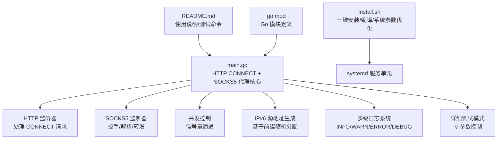
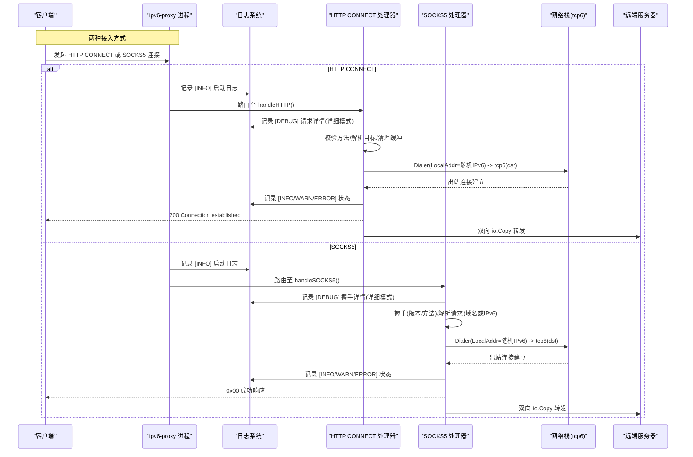
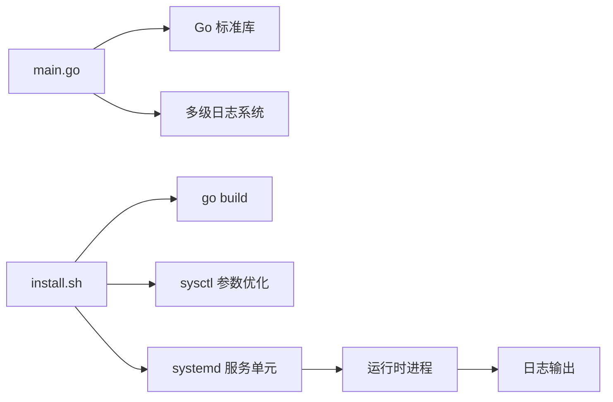

# 项目概述

<cite>
**本文引用的文件**   
- [main.go](file://main.go)
- [README.md](file://README.md)
- [install.sh](file://scripts/install.sh)
- [go.mod](file://go.mod)
</cite>

## 更新摘要
**所做更改**   
- 更新了日志系统章节，详细说明多级日志功能
- 新增了 -v 详细标志的使用说明
- 增强了错误处理和中文消息支持
- 更新了 HTTP 服务器架构改进说明
- 完善了故障排查指南中的日志相关部分

## 目录
1. [简介](#简介)
2. [项目结构](#项目结构)
3. [核心组件](#核心组件)
4. [架构总览](#架构总览)
5. [详细组件分析](#详细组件分析)
6. [依赖关系分析](#依赖关系分析)
7. [性能与并发特性](#性能与并发特性)
8. [适用场景与目标用户](#适用场景与目标用户)
9. [故障排查指南](#故障排查指南)
10. [结论](#结论)

## 简介
本项目是一个轻量级的 IPv6 代理服务器，提供 HTTP CONNECT 与 SOCKS5 双协议支持，强制使用 IPv6 出口，并通过随机源 IP 池实现多出口分流。其设计目标是：
- 以最小依赖和极简代码提供稳定、高性能的 IPv6 出口能力
- 通过并发限流保护系统资源，避免连接风暴导致崩溃
- 在同一 /64 前缀下，利用更小的子网（如 /112）进行隔离，便于横向扩展与多实例部署
- 与上层聚合工具（如 v2ray/xray 的 smux）配合，缓解路由器 conntrack 压力

技术栈选择 Go 语言的原因：
- 标准库原生支持网络编程与并发模型，适合构建高并发代理
- 零外部依赖，编译产物体积小、部署简单
- 跨平台可移植性良好，易于在容器或裸机环境中运行

**新增特性**：
- **多级日志系统**：支持 INFO、WARN、ERROR、DEBUG 四个级别，便于问题诊断
- **详细调试模式**：通过 `-v` 参数启用详细的调试输出
- **中文错误消息**：所有错误信息均使用中文，提升用户体验
- **优化的 HTTP 服务器架构**：使用自定义 Server 绕过路由限制，提高灵活性

## 项目结构
仓库采用极简结构，核心逻辑集中在单一入口文件中，配套安装脚本与服务配置用于快速部署。

图表来源
- [main.go:18-37](file://main.go#L18-L37)
- [main.go:31-76](file://main.go#L31-L76)
- [install.sh:60-101](file://scripts/install.sh#L60-L101)

章节来源
- [main.go:1-382](file://main.go#L1-L382)
- [install.sh:1-101](file://scripts/install.sh#L1-L101)
- [README.md:1-98](file://README.md#L1-L98)
- [go.mod:1-4](file://go.mod#L1-L4)

## 核心组件
- 进程入口与启动流程
  - 解析命令行参数（HTTP/SOCKS5 监听地址、IPv6 前缀、并发上限、详细模式）
  - 校验并加载 IPv6 前缀 CIDR
  - 初始化随机数源与并发信号量
  - 并行启动 HTTP CONNECT 与 SOCKS5 监听服务
- HTTP CONNECT 处理器
  - 仅允许 CONNECT 方法
  - Hijack 客户端连接，清空残留缓冲
  - 基于随机源 IP 建立 tcp6 出站连接
  - 双向数据转发，记录成功/失败日志
- SOCKS5 处理器
  - 握手阶段仅接受无认证方式
  - 解析请求，仅支持域名与 IPv6 地址类型，拒绝 IPv4
  - 基于随机源 IP 建立 tcp6 出站连接
  - 双向数据转发，返回标准响应码
- 并发控制
  - 使用带缓冲通道作为信号量，限制最大并发连接数
  - 超出限制时直接拒绝新连接，防止资源耗尽
- IPv6 源地址生成
  - 根据给定前缀长度计算主机位范围
  - 随机填充主机位，保证同一前缀下的随机出口 IP
- **增强的日志系统**
  - 四级日志级别：INFO（信息）、WARN（警告）、ERROR（错误）、DEBUG（调试）
  - 彩色输出区分不同级别
  - 详细模式下输出调试信息
  - 结构化日志格式，包含时间戳和消息前缀

章节来源
- [main.go:18-43](file://main.go#L18-L43)
- [main.go:53-102](file://main.go#L53-L102)
- [main.go:134-231](file://main.go#L134-L231)
- [main.go:252-309](file://main.go#L252-L309)
- [main.go:105-130](file://main.go#L105-L130)
- [main.go:25-44](file://main.go#L25-L44)

## 架构总览
下图展示了从客户端到远端服务器的整体数据流向，包括协议适配、并发控制、源 IP 分配与出站连接建立等关键步骤。

图表来源
- [main.go:31-76](file://main.go#L31-L76)
- [main.go:134-231](file://main.go#L134-L231)
- [main.go:252-309](file://main.go#L252-L309)
- [main.go:25-44](file://main.go#L25-L44)

## 详细组件分析

### 进程启动与参数解析
- 参数项
  - HTTP 监听地址（默认 0.0.0.0:53420）
  - SOCKS5 监听地址（默认 0.0.0.0:53421）
  - IPv6 前缀（默认示例为 /112）
  - 并发上限（默认 5000）
  - **详细模式标志**（-v，默认 false）
- 启动流程
  - 解析参数并校验前缀 CIDR
  - 初始化 server 结构体（网络前缀、随机源、互斥锁、信号量）
  - 并行启动 HTTP 与 SOCKS5 监听，等待退出
  - **输出启动信息到 INFO 日志**

**更新** 新增了详细模式参数支持和启动日志输出

章节来源
- [main.go:18-23](file://main.go#L18-L23)
- [main.go:53-76](file://main.go#L53-L76)

### HTTP CONNECT 处理器
- 行为要点
  - 仅接受 CONNECT 方法，否则返回 405
  - 目标地址解析：优先 r.Host，缺失则回退 URL.Host，未显式端口补 443
  - 并发控制：进入前尝试获取信号量，失败即返回 503
  - 连接劫持：Hijack 后清空可能残留缓冲，设置 TCP_NODELAY
  - 出站连接：使用随机源 IP 通过 tcp6 拨号，失败返回 502
  - 数据转发：双向 io.Copy，完成后关闭两端连接
- 错误处理
  - 方法非法、Hijack 失败、拨号失败均有明确日志与状态码返回
  - **所有错误消息使用中文显示**
  - **详细模式下输出请求方法和URL信息**

**更新** 增强了错误处理的中文消息支持和详细日志输出

章节来源
- [main.go:134-231](file://main.go#L134-L231)

### SOCKS5 处理器
- 握手阶段
  - 读取版本号与方法列表，仅接受无认证（0x00）
- 请求解析
  - 仅支持 CONNECT 命令（0x01）
  - 地址类型：拒绝 IPv4（0x01），支持域名（0x03）与 IPv6（0x04）
  - 端口为大端序 16 位
- 出站连接与转发
  - 使用随机源 IP 通过 tcp6 拨号
  - 成功返回 0x00，失败返回相应错误码
  - 双向 io.Copy 转发数据
- 错误处理
  - 握手失败、命令不支持、地址类型不支持均返回对应响应码
  - **所有错误信息使用中文描述**
  - **详细模式下输出握手和解析过程**

**更新** 改进了错误消息的本地化和详细调试支持

章节来源
- [main.go:252-309](file://main.go#L252-L309)
- [main.go:311-381](file://main.go#L311-L381)

### 并发控制机制
- 使用带缓冲通道作为信号量，容量由 -c 参数决定
- 每个入站连接在进入处理逻辑前尝试获取令牌，失败立即拒绝
- 处理结束后释放令牌，确保资源回收
- **详细模式下输出当前并发状态**

**更新** 增加了并发状态的详细日志输出

章节来源
- [main.go:18-22](file://main.go#L18-L22)
- [main.go:153-161](file://main.go#L153-L161)
- [main.go:255-262](file://main.go#L255-L262)

### IPv6 源地址生成算法
- 输入：CIDR 前缀（例如 /112）
- 计算主机位数量与字节边界
- 随机填充完整字节段，并对不足一字节的部分按掩码低位随机化
- 输出：符合前缀范围的随机 IPv6 地址

图表来源
- [main.go:105-130](file://main.go#L105-L130)

章节来源
- [main.go:105-130](file://main.go#L105-L130)

### 增强的日志系统
- **四级日志级别**
  - INFO：常规操作信息，输出到标准输出
  - WARN：警告信息，输出到标准输出
  - ERROR：错误信息，输出到标准错误
  - DEBUG：调试信息，仅在详细模式下输出
- **日志格式**
  - 包含时间戳和消息前缀
  - 彩色输出便于区分不同级别
  - 结构化格式便于日志分析
- **详细模式控制**
  - 通过 -v 参数启用
  - 输出详细的请求处理过程
  - 包含并发状态、握手细节等信息

**新增** 完整的日志系统实现，支持生产环境和问题诊断

章节来源
- [main.go:25-44](file://main.go#L25-L44)

## 依赖关系分析
- 语言与标准库
  - Go 标准库提供网络、HTTP、并发原语，无需第三方依赖
  - Go 1.22 版本要求
- 外部工具（部署期）
  - ndppd：用于 IPv6 NDP 代理，使本地路由的前缀可达
  - systemd：进程管理与开机自启
- 安装脚本职责
  - 拉取源码、编译二进制
  - 写入内核参数优化配置
  - 安装 systemd 服务单元
  - 提示后续配置步骤（本地路由、ndppd 配置、启动服务）

图表来源
- [main.go:1-16](file://main.go#L1-L16)
- [main.go:25-44](file://main.go#L25-L44)
- [install.sh:60-101](file://scripts/install.sh#L60-L101)
- [go.mod:1-4](file://go.mod#L1-L4)

章节来源
- [main.go:1-16](file://main.go#L1-L16)
- [install.sh:60-101](file://scripts/install.sh#L60-L101)
- [go.mod:1-4](file://go.mod#L1-L4)

## 性能与并发特性
- 并发上限
  - 通过 -c 参数控制最大并发连接数，避免内存与文件描述符耗尽
- 低延迟优化
  - 对 TCP 连接启用 TCP_NODELAY，减少小包延迟
- 资源管理
  - 连接建立失败及时返回错误码，避免挂起
  - 双向转发完成后主动关闭连接，释放资源
- 可扩展性
  - 同一 /64 前缀下可使用 /112 子网隔离多实例，降低冲突概率
  - 与 smux 等复用层结合，进一步降低路由器 conntrack 压力
- **日志性能优化**
  - 详细日志仅在 -v 模式下启用，避免生产环境性能影响
  - 异步日志输出，减少主处理路径开销

**更新** 增加了日志系统的性能考虑和优化策略

章节来源
- [main.go:153-161](file://main.go#L153-161)
- [main.go:184-186](file://main.go#L184-L186)
- [main.go:205-207](file://main.go#L205-L207)
- [main.go:40-44](file://main.go#L40-L44)
- [README.md:7-11](file://README.md#L7-L11)

## 适用场景与目标用户
- 需要 IPv6 出口 IP 的网络应用
  - 访问仅支持 IPv6 的服务或 API
- 爬虫系统与数据采集
  - 通过多出口 IP 分散请求来源，降低封禁风险
- API 调用服务
  - 将内部服务流量经 IPv6 出口转发，满足合规或网络策略要求
- 与 v2ray/xray 集成
  - 借助 smux 聚合连接，提升吞吐并减轻网络设备负担
- **运维与监控人员**
  - 通过多级日志系统进行问题诊断和性能监控
  - 使用详细模式进行故障排查和性能分析

**更新** 新增了运维人员的适用场景说明

章节来源
- [README.md:7-11](file://README.md#L7-L11)

## 故障排查指南
- 常见错误与定位
  - 方法非法：HTTP 非 CONNECT 请求将被拒绝（405）
  - 连接过多：超过并发上限会返回 503 或直接拒绝
  - 拨号失败：tcp6 无法连通目标时返回 502（HTTP）或 SOCKS5 错误码
  - 地址类型不支持：SOCKS5 仅支持域名与 IPv6，IPv4 被拒绝
- **日志观察与分析**
  - **INFO 日志**：查看服务启动、连接成功等常规信息
  - **WARN 日志**：关注连接超限、缓冲清空失败等警告信息
  - **ERROR 日志**：重点检查连接失败、Hijack 失败等错误
  - **DEBUG 日志**：使用 -v 参数启用，查看详细处理流程
  - **结构化日志格式**：便于使用 grep、awk 等工具进行分析
- **详细模式使用**
  - 启动时添加 -v 参数：`./ipv6-proxy -v ...`
  - 输出详细的握手过程、并发状态、请求详情
  - 适用于问题复现和性能分析
- **部署检查清单**
  - 确认已开启 net.ipv6.ip_nonlocal_bind 与转发
  - 添加本地路由指向所需前缀
  - 配置并启动 ndppd，确保 NDP 代理生效
  - 使用 systemctl 管理服务，journalctl 查看运行日志
  - **检查日志输出是否正常**

**更新** 大幅增强了日志相关的故障排查内容，提供了详细的日志级别说明和使用方法

章节来源
- [main.go:137-141](file://main.go#L137-L141)
- [main.go:153-161](file://main.go#L153-L161)
- [main.go:196-202](file://main.go#L196-L202)
- [main.go:342-343](file://main.go#L342-L343)
- [main.go:25-44](file://main.go#L25-L44)
- [main.go:40-44](file://main.go#L40-L44)
- [install.sh:73-85](file://scripts/install.sh#L73-L85)
- [README.md:28-57](file://README.md#L28-L57)

## 结论
该项目以极小代码面实现了功能完备的 IPv6 代理能力，具备以下优势：
- 双协议支持，兼容广泛客户端
- 强制 IPv6 出口，满足特定网络策略需求
- 内置并发限流与完善的错误处理，稳定性强
- 零依赖、易部署，适合生产环境快速落地
- 可与上层复用层协同，进一步提升整体性能与可扩展性
- **增强的日志系统**：支持多级日志和详细调试模式，便于问题诊断
- **中文错误消息**：提升用户体验，降低学习成本
- **优化的 HTTP 服务器架构**：提供更灵活的处理能力和更好的兼容性

**新增价值**：
- 完善的日志体系支持生产环境的监控和故障排查
- 详细调试模式帮助开发者快速定位问题
- 本地化的错误信息提升了易用性
- 架构改进提高了系统的稳定性和扩展性