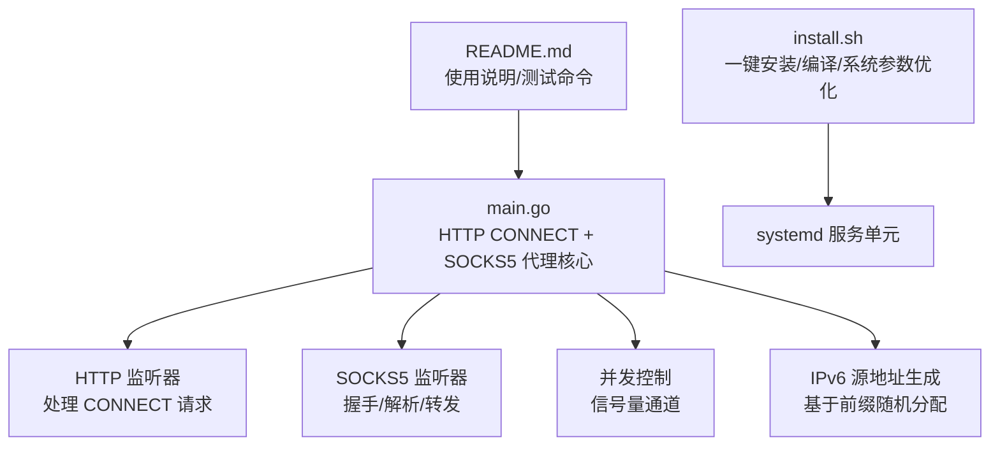
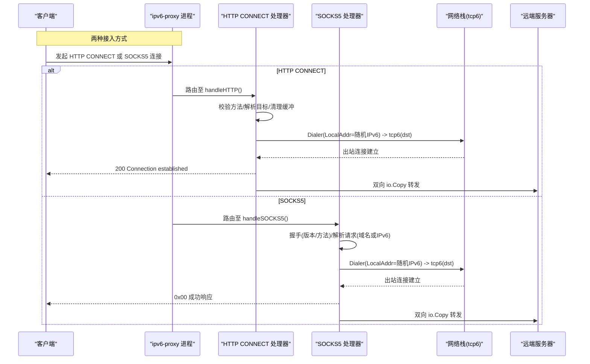
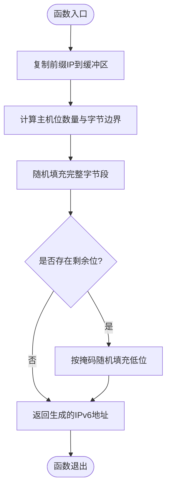
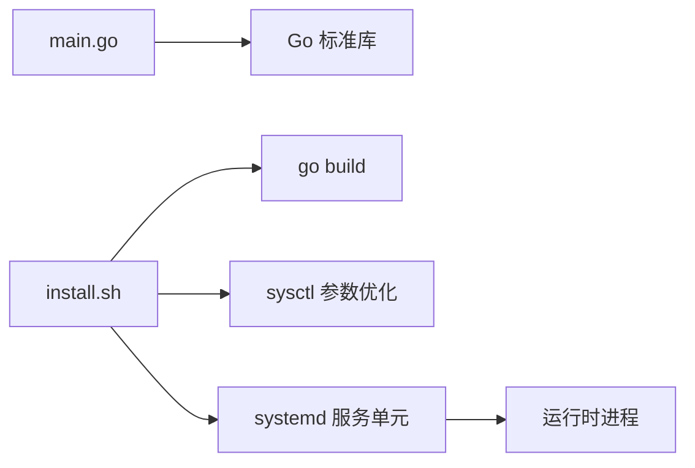

# 项目概述

<cite>
**本文引用的文件**   
- [main.go](file://main.go)
- [REDME.md](file://REDME.md)
- [install.sh](file://scripts/install.sh)
</cite>

## 目录
1. [简介](#简介)
2. [项目结构](#项目结构)
3. [核心组件](#核心组件)
4. [架构总览](#架构总览)
5. [详细组件分析](#详细组件分析)
6. [依赖关系分析](#依赖关系分析)
7. [性能与并发特性](#性能与并发特性)
8. [适用场景与目标用户](#适用场景与目标用户)
9. [故障排查指南](#故障排查指南)
10. [结论](#结论)

## 简介
本项目是一个轻量级的 IPv6 代理服务器，提供 HTTP CONNECT 与 SOCKS5 双协议支持，强制使用 IPv6 出口，并通过随机源 IP 池实现多出口分流。其设计目标是：
- 以最小依赖和极简代码提供稳定、高性能的 IPv6 出口能力
- 通过并发限流保护系统资源，避免连接风暴导致崩溃
- 在同一 /64 前缀下，利用更小的子网（如 /112）进行隔离，便于横向扩展与多实例部署
- 与上层聚合工具（如 v2ray/xray 的 smux）配合，缓解路由器 conntrack 压力

技术栈选择 Go 语言的原因：
- 标准库原生支持网络编程与并发模型，适合构建高并发代理
- 零外部依赖，编译产物体积小、部署简单
- 跨平台可移植性良好，易于在容器或裸机环境中运行

## 项目结构
仓库采用极简结构，核心逻辑集中在单一入口文件中，配套安装脚本与服务配置用于快速部署。

图表来源
- [main.go:31-76](file://main.go#L31-L76)
- [install.sh:60-101](file://scripts/install.sh#L60-L101)

章节来源
- [main.go:1-76](file://main.go#L1-L76)
- [install.sh:1-101](file://scripts/install.sh#L1-L101)
- [REDME.md:1-25](file://REDME.md#L1-L25)

## 核心组件
- 进程入口与启动流程
  - 解析命令行参数（HTTP/SOCKS5 监听地址、IPv6 前缀、并发上限）
  - 校验并加载 IPv6 前缀 CIDR
  - 初始化随机数源与并发信号量
  - 并行启动 HTTP CONNECT 与 SOCKS5 监听服务
- HTTP CONNECT 处理器
  - 仅允许 CONNECT 方法
  - Hijack 客户端连接，清空残留缓冲
  - 基于随机源 IP 建立 tcp6 出站连接
  - 双向数据转发，记录成功/失败日志
- SOCKS5 处理器
  - 握手阶段仅接受无认证方式
  - 解析请求，仅支持域名与 IPv6 地址类型，拒绝 IPv4
  - 基于随机源 IP 建立 tcp6 出站连接
  - 双向数据转发，返回标准响应码
- 并发控制
  - 使用带缓冲通道作为信号量，限制最大并发连接数
  - 超出限制时直接拒绝新连接，防止资源耗尽
- IPv6 源地址生成
  - 根据给定前缀长度计算主机位范围
  - 随机填充主机位，保证同一前缀下的随机出口 IP

章节来源
- [main.go:17-43](file://main.go#L17-L43)
- [main.go:78-104](file://main.go#L78-L104)
- [main.go:108-197](file://main.go#L108-L197)
- [main.go:201-274](file://main.go#L201-L274)
- [main.go:276-346](file://main.go#L276-L346)

## 架构总览
下图展示了从客户端到远端服务器的整体数据流向，包括协议适配、并发控制、源 IP 分配与出站连接建立等关键步骤。

图表来源
- [main.go:31-76](file://main.go#L31-L76)
- [main.go:108-197](file://main.go#L108-L197)
- [main.go:201-274](file://main.go#L201-L274)

## 详细组件分析

### 进程启动与参数解析
- 参数项
  - HTTP 监听地址（默认 0.0.0.0:53420）
  - SOCKS5 监听地址（默认 0.0.0.0:53421）
  - IPv6 前缀（默认示例为 /112）
  - 并发上限（默认 5000）
- 启动流程
  - 解析参数并校验前缀 CIDR
  - 初始化 server 结构体（网络前缀、随机源、互斥锁、信号量）
  - 并行启动 HTTP 与 SOCKS5 监听，等待退出

章节来源
- [main.go:17-43](file://main.go#L17-L43)
- [main.go:31-76](file://main.go#L31-L76)

### HTTP CONNECT 处理器
- 行为要点
  - 仅接受 CONNECT 方法，否则返回 405
  - 目标地址解析：优先 r.Host，缺失则回退 URL.Host，未显式端口补 443
  - 并发控制：进入前尝试获取信号量，失败即返回 503
  - 连接劫持：Hijack 后清空可能残留缓冲，设置 TCP_NODELAY
  - 出站连接：使用随机源 IP 通过 tcp6 拨号，失败返回 502
  - 数据转发：双向 io.Copy，完成后关闭两端连接
- 错误处理
  - 方法非法、Hijack 失败、拨号失败均有明确日志与状态码返回

章节来源
- [main.go:108-197](file://main.go#L108-L197)

### SOCKS5 处理器
- 握手阶段
  - 读取版本号与方法列表，仅接受无认证（0x00）
- 请求解析
  - 仅支持 CONNECT 命令（0x01）
  - 地址类型：拒绝 IPv4（0x01），支持域名（0x03）与 IPv6（0x04）
  - 端口为大端序 16 位
- 出站连接与转发
  - 使用随机源 IP 通过 tcp6 拨号
  - 成功返回 0x00，失败返回相应错误码
  - 双向 io.Copy 转发数据
- 错误处理
  - 握手失败、命令不支持、地址类型不支持均返回对应响应码

章节来源
- [main.go:201-274](file://main.go#L201-L274)
- [main.go:276-346](file://main.go#L276-L346)

### 并发控制机制
- 使用带缓冲通道作为信号量，容量由 -c 参数决定
- 每个入站连接在进入处理逻辑前尝试获取令牌，失败立即拒绝
- 处理结束后释放令牌，确保资源回收

章节来源
- [main.go:17-22](file://main.go#L17-L22)
- [main.go:126-133](file://main.go#L126-L133)
- [main.go:221-227](file://main.go#L221-L227)

### IPv6 源地址生成算法
- 输入：CIDR 前缀（例如 /112）
- 计算主机位数量与字节边界
- 随机填充完整字节段，并对不足一字节的部分按掩码低位随机化
- 输出：符合前缀范围的随机 IPv6 地址

图表来源
- [main.go:78-104](file://main.go#L78-L104)

章节来源
- [main.go:78-104](file://main.go#L78-L104)

## 依赖关系分析
- 语言与标准库
  - Go 标准库提供网络、HTTP、并发原语，无需第三方依赖
- 外部工具（部署期）
  - ndppd：用于 IPv6 NDP 代理，使本地路由的前缀可达
  - systemd：进程管理与开机自启
- 安装脚本职责
  - 拉取源码、编译二进制
  - 写入内核参数优化配置
  - 安装 systemd 服务单元
  - 提示后续配置步骤（本地路由、ndppd 配置、启动服务）

图表来源
- [main.go:1-15](file://main.go#L1-L15)
- [install.sh:60-101](file://scripts/install.sh#L60-L101)

章节来源
- [main.go:1-15](file://main.go#L1-L15)
- [install.sh:60-101](file://scripts/install.sh#L60-L101)

## 性能与并发特性
- 并发上限
  - 通过 -c 参数控制最大并发连接数，避免内存与文件描述符耗尽
- 低延迟优化
  - 对 TCP 连接启用 TCP_NODELAY，减少小包延迟
- 资源管理
  - 连接建立失败及时返回错误码，避免挂起
  - 双向转发完成后主动关闭连接，释放资源
- 可扩展性
  - 同一 /64 前缀下可使用 /112 子网隔离多实例，降低冲突概率
  - 与 smux 等复用层结合，进一步降低路由器 conntrack 压力

章节来源
- [main.go:126-133](file://main.go#L126-L133)
- [main.go:153-155](file://main.go#L153-L155)
- [main.go:172-174](file://main.go#L172-L174)
- [REDME.md:7-11](file://REDME.md#L7-L11)

## 适用场景与目标用户
- 需要 IPv6 出口 IP 的网络应用
  - 访问仅支持 IPv6 的服务或 API
- 爬虫系统与数据采集
  - 通过多出口 IP 分散请求来源，降低封禁风险
- API 调用服务
  - 将内部服务流量经 IPv6 出口转发，满足合规或网络策略要求
- 与 v2ray/xray 集成
  - 借助 smux 聚合连接，提升吞吐并减轻网络设备负担

章节来源
- [REDME.md:7-11](file://REDME.md#L7-L11)

## 故障排查指南
- 常见错误与定位
  - 方法非法：HTTP 非 CONNECT 请求将被拒绝（405）
  - 连接过多：超过并发上限会返回 503 或直接拒绝
  - 拨号失败：tcp6 无法连通目标时返回 502（HTTP）或 SOCKS5 错误码
  - 地址类型不支持：SOCKS5 仅支持域名与 IPv6，IPv4 被拒绝
- 日志观察
  - 成功/失败路径均有结构化日志，包含目标地址与源 IP，便于追踪
- 部署检查清单
  - 确认已开启 net.ipv6.ip_nonlocal_bind 与转发
  - 添加本地路由指向所需前缀
  - 配置并启动 ndppd，确保 NDP 代理生效
  - 使用 systemctl 管理服务，journalctl 查看运行日志

章节来源
- [main.go:112-115](file://main.go#L112-L115)
- [main.go:126-133](file://main.go#L126-L133)
- [main.go:165-169](file://main.go#L165-L169)
- [main.go:248-252](file://main.go#L248-L252)
- [main.go:306-327](file://main.go#L306-L327)
- [install.sh:73-85](file://scripts/install.sh#L73-L85)
- [REDME.md:28-57](file://REDME.md#L28-L57)

## 结论
该项目以极小代码面实现了功能完备的 IPv6 代理能力，具备以下优势：
- 双协议支持，兼容广泛客户端
- 强制 IPv6 出口，满足特定网络策略需求
- 内置并发限流与完善的错误处理，稳定性强
- 零依赖、易部署，适合生产环境快速落地
- 可与上层复用层协同，进一步提升整体性能与可扩展性